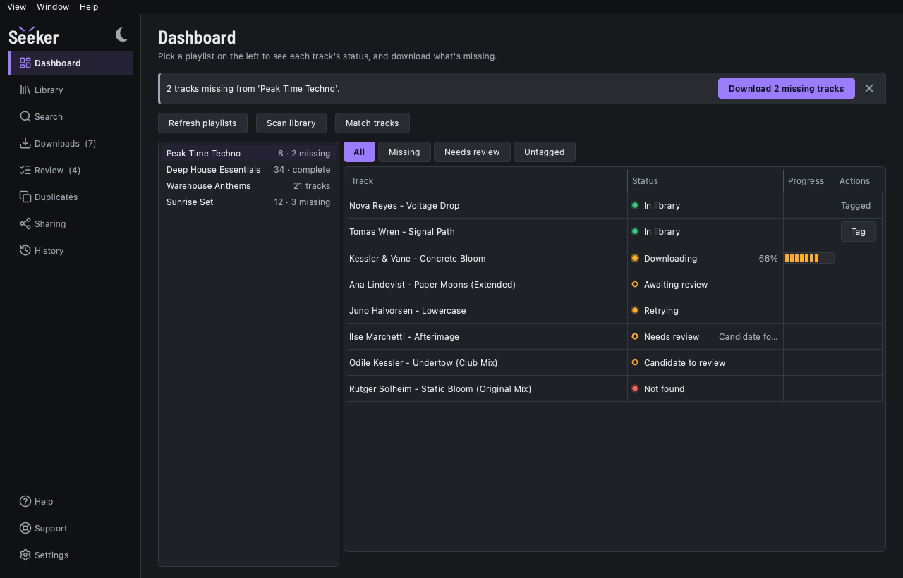
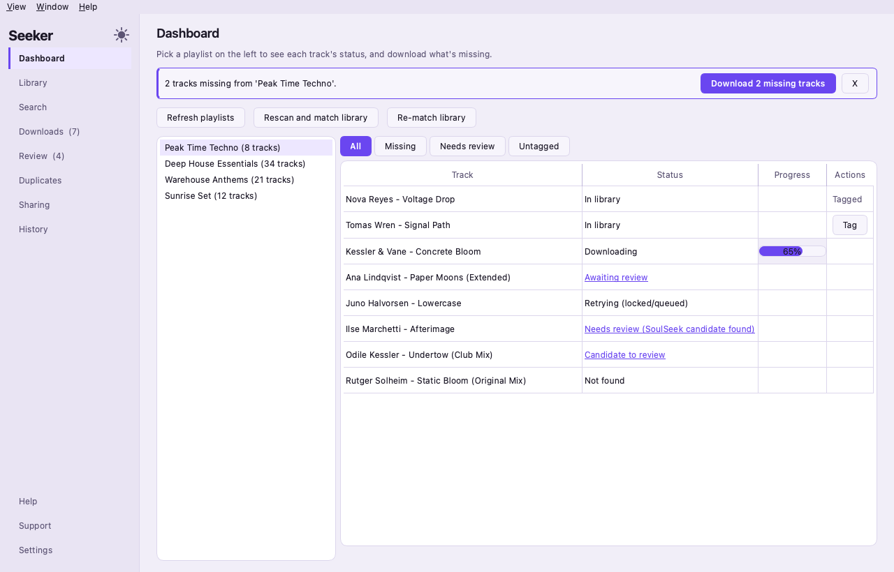
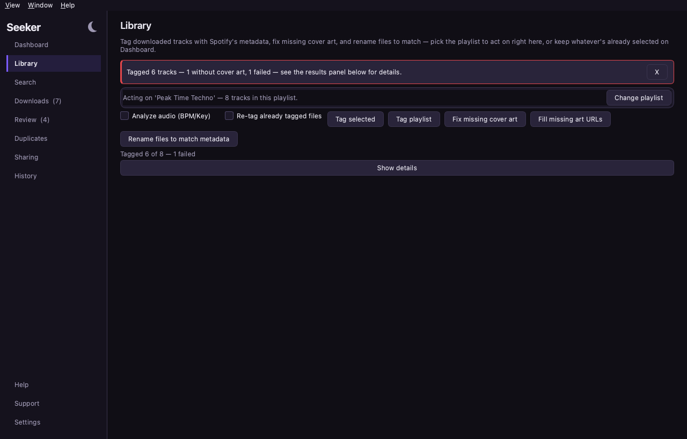
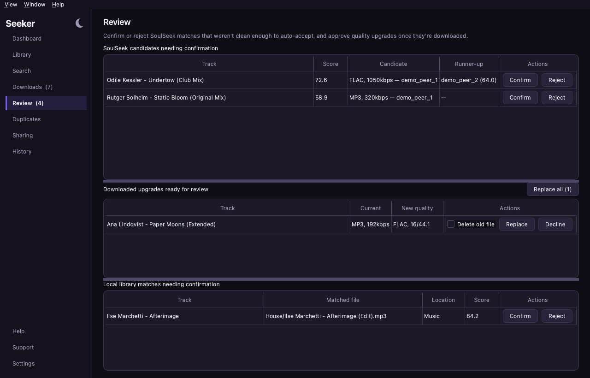
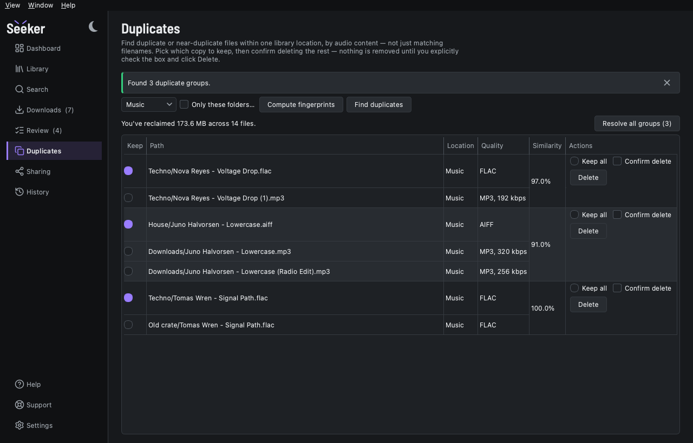
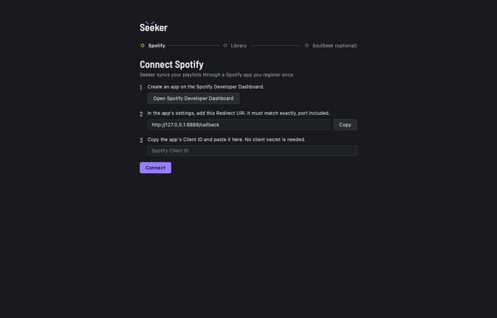

# Seeker

[](https://github.com/KristiyanDDimitrov/Seeker/actions/workflows/ci.yml)


Seeker keeps a DJ's music library in step with their Spotify playlists.
It works out which tracks you already have on disk, finds the
best-quality copy of each missing one on SoulSeek, downloads it into
the right folder, and tags it with Spotify's metadata and cover art.

It is for anyone who builds sets from Spotify playlists but plays from
local files, and is tired of doing that bookkeeping by hand. It runs on
your own Mac, with a desktop app and a command line over the same
code, and it talks to SoulSeek through
[`slskd`](https://github.com/slskd/slskd), a self-hosted daemon that
Seeker sets up for you in Docker.



<details>
<summary>More screens</summary>

| | |
|---|---|
|  Dashboard (light) |  Library |
|  Review |  Duplicates |
|  Setup wizard | |

Every image is rendered from invented data by
`uv run python tools/screenshots.py --readme`.
</details>

## Features

- **Playlist sync that spares the API.** Playlists and tracks are cached
  in a local SQLite database; a playlist is re-read only when Spotify
  says it changed.
- **Matching against what you own.** Each track is fuzzy-matched to
  your files and marked matched, needs review, or missing. A match you
  confirm stays confirmed, and a file you reject is never suggested
  again.
- **The best copy, not the first.** Missing tracks are searched on
  SoulSeek and candidates ranked by format, bitrate and the peer's
  queue. When a better file exists but isn't available now, Seeker
  keeps it as an upgrade for you to accept later.
- **Downloads that land in the right place.** Each playlist has a
  destination folder. A finished download is moved there, indexed and
  matched, and never written over an existing file.
- **Tagging.** Spotify's artist, title, album and cover art go onto
  matched files; BPM and Camelot key analysis is optional. Files can be
  renamed to `Artist - Title`.
- **Duplicates by sound.** Audio fingerprints find the same recording
  under different names; you pick which copy to keep.
- **Sharing back.** See what your slskd shares and who is downloading
  from you, and add a library folder to the share.
- **Nothing destructive without asking.** Replacing a file with an
  upgrade and deleting a duplicate both need an explicit confirmation.

## Install

Seeker is built and tested on macOS. Windows and Linux builds are
written but have never been verified on real hardware
([packaging](docs/packaging.md)).

You need:

- a [Spotify app](https://developer.spotify.com/dashboard) of your own,
  with the redirect URI `http://127.0.0.1:8888/callback`, for its Client
  ID (no secret: Seeker uses PKCE);
- [Docker Desktop](https://www.docker.com/products/docker-desktop/), for
  SoulSeek;
- optionally, `brew install chromaprint`, for duplicate detection.

**The app.** Download `Seeker.dmg` from
[Releases](https://github.com/KristiyanDDimitrov/Seeker/releases),
check it against the release's SHA-256, and drag Seeker to
Applications. Seeker needs macOS 15 or later on Apple silicon. The
build is ad-hoc signed, not notarized, so macOS blocks the first
launch: click Done, then System Settings → Privacy & Security → Open
Anyway (Control-click → Open no longer works on macOS 15 and later).
`Read Me First.txt` on the disk image has the steps, and the Terminal
alternative.

**From source.** With [`uv`](https://docs.astral.sh/uv/) installed:

```
git clone https://github.com/KristiyanDDimitrov/Seeker.git
cd Seeker
uv sync
uv run seeker-ui     # the desktop app
uv run seeker        # the command line
```

Your data stays in `~/Library/Application Support/Seeker`: the
database, settings, Spotify token and slskd's data.

## Quick start

1. **Run the setup wizard.** It opens on first launch: paste your
   Spotify Client ID and approve access in the browser, pick a library
   folder, then let it start slskd in Docker with your SoulSeek login.
   SoulSeek can be skipped and set up later in Settings. Closing the
   wizard keeps your place.
2. **Sync, scan, match.** On the Dashboard, Sync pulls your playlists;
   pick one to load its tracks. Scan reads your library folders and
   Match pairs tracks with files.
3. **Review** the matches Seeker wasn't sure of.
4. **Download** what's missing. The first time, choose the playlist's
   destination folder. Progress shows on Downloads; finished files move
   into place on their own.
5. **Tag** the playlist's files on the Library page.

The command line does the same through `seeker sync`,
`seeker library scan --match`, `seeker download <playlist>` and
others; [docs/cli.md](docs/cli.md) has every command, and how to
configure it without the wizard.

## Architecture

```
seeker (CLI) ──┐                              ┌─▶ Spotify Web API
               ├─▶ Application ─▶ services ───┼─▶ slskd REST API
seeker-ui ─────┘                    │         └─▶ audio files
                                    ▼
                    repositories (raw SQL) ─▶ SQLite
```

- **Two front ends, one service layer.** The CLI and the PySide6 app
  are thin layers over the same `Application` and services. Neither
  ever touches a repository, and `tests/test_layering.py` fails the
  build if one does.
- **Raw SQL, no ORM.** One repository per table; foreign keys enforced;
  short transactions, with slow work kept outside them.
- **Downloads are a state machine** with named groups of states, typed
  as a `StrEnum`.
- **The GUI never blocks.** Background work runs on a thread pool
  through one function, `run_worker()`, reporting back through a single
  dispatcher.

[docs/architecture.md](docs/architecture.md) has the module map, the
data flow, the download states and the threading model.

## Quality

- **CI on every push** (badge above), on a pinned macOS runner: `ruff
  check`, `mypy --strict`, then the full test suite with branch
  coverage held at 92 % or more.
- **The tests drive real Qt widgets** headless
  (`QT_QPA_PLATFORM=offscreen`) with `pytest-qt`, and mock every
  Spotify and slskd request: the suite never touches the network.
- **Hard rules are tests:** the layering, the one exception hierarchy,
  escaped peer-supplied strings, keyboard access, and table and button
  sizing each have a test that walks the code or every screen.
- **Supply chain:** `uv sync --locked`, and every GitHub Action pinned
  to a commit SHA and bumped by Dependabot.

```
uv run pytest -q                 # the suite
uv run mypy --strict src/        # types
uv run ruff check src tests tools
```

A few tests skip by design: round trips against an external drive the
CI runner lacks, and one opt-in stress test that drives the real
pipeline.

## More

- [docs/README.md](docs/README.md): every document, and where to start.
- [docs/architecture.md](docs/architecture.md), [docs/cli.md](docs/cli.md),
  [docs/packaging.md](docs/packaging.md).
- [CLAUDE.md](CLAUDE.md): conventions and the standing facts behind
  them, written for whoever changes the code next.
- [docs/history/](docs/history/README.md): every investigation, from
  first symptom to fix.
- [SECURITY.md](SECURITY.md): reporting a vulnerability.

## License

MIT; see [`LICENSE`](LICENSE). Third-party licences are listed in the
app's About Seeker window.
