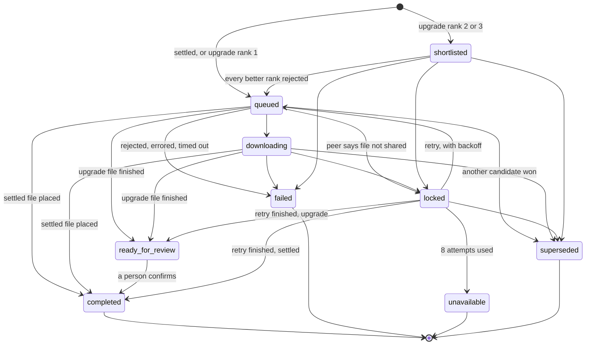

# Seeker architecture

How the code is put together: the layers and the rule that keeps them
apart, where every module lives, how a track travels from a Spotify
playlist to a tagged file, the states a download moves through, and
which thread runs what. The conventions behind each rule are in
[`../CLAUDE.md`](../CLAUDE.md); the investigations behind them are in
[`history/`](history/README.md).

## Layers

```
Presentation    cli.py, ui/*                  (two front ends, one service layer)
     │
Services        application.py, spotify/sync_service.py, library/*,
     │          soulseek/*, dashboard_service.py, history_service.py
     │
Repositories    database/repositories/*       (raw SQL, one per table)
     │
Database        database/connection.py, database/schema.py   (SQLite)
```

**Presentation code never imports a repository.** Every CLI handler
and every Qt widget goes through `Application` or a service it exposes.
When a screen or command needs data that no service offers, a service
method is added; the presentation layer never assembles it from
repositories. The front end is the part that changes most often, and
the repositories are where correctness matters most, so the service
layer between them keeps a UI change from skipping a transaction or an
invariant, and keeps the logic testable without argparse or a Qt event
loop.

`tests/test_layering.py` reads every import under `src/seeker/` and
fails the build when:

- `ui/`, `cli.py` or an entry point imports `seeker.database`;
- `cli.py` imports `seeker.ui`;
- anything outside `ui/` and `main_ui.py` imports Qt;
- `models/` imports anything but `models/`.

`Application` (`application.py`) is the composition root. It owns the
`Database`, the settings (`config_store.SeekerConfig`, with `.env`
values from `config.py` as the fallback), and builds each service
lazily on first use. Services take `get_config` as a callable, not a
snapshot, so a Settings change applies without a restart.

Data access is raw SQL through one repository per table, not an ORM.
The schema is the source of truth for which states the data can be in:
foreign keys are enforced (`PRAGMA foreign_keys = ON`), and
`Database.transaction()` opens a new connection per call, so it is
safe from any thread.

## Tech stack

| Concern | Choice |
|---|---|
| Language, environment | Python 3.13, [`uv`](https://docs.astral.sh/uv/) (not pip or poetry) |
| GUI | [PySide6](https://doc.qt.io/qtforpython/): the Fusion style under Seeker's own QSS theme, `QThreadPool` for background work |
| HTTP | [`httpx`](https://www.python-httpx.org/), synchronous, for both Spotify and slskd: one pattern, one way to test it (mock the transport) |
| Data | SQLite through the standard library's `sqlite3`; raw SQL, no ORM |
| Matching | [`rapidfuzz`](https://github.com/rapidfuzz/RapidFuzz) |
| Audio | [`mutagen`](https://mutagen.readthedocs.io/) for tags, [`librosa`](https://librosa.org/) for BPM and key, a project-owned `ctypes` binding to `libchromaprint` for fingerprints (optional; looked up only when used) |
| SoulSeek | [`slskd`](https://github.com/slskd/slskd) in Docker, through its REST API, not a protocol implementation |
| Packaging | PyInstaller (one folder), `dmgbuild`, Inno Setup ([packaging.md](packaging.md)) |

## Design principles

- **The schema guards the data.** Multi-step writes share one
  transaction, and enforced foreign keys keep the database from
  holding a dangling reference, whatever the code above does.
- **One bad item never aborts a batch.** Every loop over tracks or
  downloads (`download_playlist`, `poll_downloads`, tagging, scanning)
  handles each item on its own, so one network blip or missing file is
  counted as one failure and the rest carry on.
- **Real responses over documentation.** Spotify's and slskd's docs
  have been wrong or silent about response shapes more than once;
  several fixes exist because a live run showed the mismatch. Where it
  matters, tests use captured real responses and real files.
- **A file is destroyed only on an explicit confirmation.** Replacing
  a file with an upgrade and deleting a duplicate both ask first.
  Writing tags is treated as non-destructive and runs without asking,
  but is saved through a copy when it would otherwise shift audio in
  place.

## Module map

The one canonical layout of `src/seeker/`.

```
src/seeker/
├── application.py           # composition root: settings, services, slskd bring-up
├── cli.py                   # `seeker`: argparse handlers; prints, prompts
├── main.py                  # `seeker` entry point (logging to stderr)
├── main_ui.py               # `seeker-ui` entry point (rotating log file)
├── config.py                # .env fallback values, read at call time
├── config_store.py          # SeekerConfig: config.json, the UI-editable store
├── errors.py                # SeekerError, and errors raised by >1 module
├── error_text.py            # describe_error(): readable text for any failure
├── formatting.py            # sizes, timestamps, speeds (CLI and UI)
├── due.py                   # is_due(): the sweep's and update check's interval
├── matching.py              # fuzzy artist/title scoring, thresholds
├── destination_resolution.py  # where a playlist's files go; subfolder validation
├── download_dedup.py        # "the same candidate" key
├── dashboard_service.py     # playlist-scoped track status, active downloads
├── history_service.py       # derived view of downloads and tags (no table)
├── album_art_cache.py       # cover art downloaded once per URL
├── update_check.py          # one GitHub Releases request; Help, or opt-in at startup
├── login_item.py            # macOS "start at login" (SMAppService)
├── _build_info.py           # build identity; "dev" outside a packaged build
│
├── database/
│   ├── connection.py        # Database, transaction(), migrations (_migrate)
│   ├── schema.py            # every table, with each column's meaning
│   └── repositories/        # _repository.py base, then one per table:
│                            #   playlist, track, track_match, local_file,
│                            #   library_location, download_request,
│                            #   soulseek_review_candidate, rejection,
│                            #   duplicate_cleanup, location_merge
├── spotify/
│   ├── auth.py              # PKCE verifier/challenge, authorize URL
│   ├── auth_manager.py      # valid token on demand; one refresh at a time
│   ├── callback_server.py   # loopback redirect listener
│   ├── token.py, token_store.py  # the cached token (0600 file)
│   ├── client.py            # raw Web API calls (httpx)
│   └── sync_service.py      # playlists and tracks into the cache
├── library/
│   ├── scanner.py           # walk locations, read tags into local_files
│   ├── matcher.py           # TrackMatcher: Spotify track ↔ local file
│   ├── service.py           # LibraryService: locations, scan, remove, merge
│   ├── nesting.py           # whether one location sits inside another
│   ├── metadata_service.py  # write Spotify tags and art; rename; fix art
│   └── duplicate_service.py # fingerprint clustering, resolve a group
├── soulseek/
│   ├── client.py            # SoulseekClient: slskd REST (httpx)
│   ├── quality.py           # filter and rank search candidates
│   ├── download_service.py  # download a playlist or one track
│   ├── poller.py            # poll_downloads: status, cascade, locked retry
│   ├── placement.py         # find a finished file, move it, index it
│   ├── review_service.py    # Review's decisions: candidates, upgrades
│   ├── docker_setup.py      # Docker and slskd detection, bring-up, health
│   └── sharing_service.py   # what slskd shares; add a location to it
├── audio/
│   ├── analysis.py          # BPM and Camelot key (librosa)
│   ├── fingerprint.py       # libchromaprint ctypes binding
│   ├── formats.py           # AUDIO_EXTENSIONS, DOWNLOADABLE_EXTENSIONS
│   ├── quality.py           # a local file's format and bitrate
│   └── tags.py              # read and write ID3/FLAC/MP4 tags; save_tags()
├── files/
│   ├── atomic.py            # atomic writes; 0600 writes; 0700 dirs; rewrite_via_copy()
│   ├── deletion.py          # delete a file the library knows about
│   ├── placement.py         # resolve_collision(): never land on a file
│   ├── sanitize.py          # clean_path_component()
│   └── naming.py            # build_track_filename()
├── models/                  # dataclasses and enums, no behaviour beyond
│                            #   derived fields: one module per entity
│                            #   (playlist, track, track_match, local_file,
│                            #   download_request, …) and per service
│                            #   result (download_result, library_result,
│                            #   tag_result, fingerprint_result, …)
└── ui/                      # `seeker-ui` (PySide6)
    ├── main_window.py       # the shell: sidebar, menus, timers, event filter
    ├── window_lifecycle.py  # geometry, hide to tray, Dock icon, quit
    ├── tray.py              # tray icon, menu, notifications
    ├── pages/
    │   ├── context.py       # PageContext: the shell ↔ page seam
    │   ├── dashboard_page.py, library_page.py, tagging_panel.py,
    │   ├── search_page.py, downloads_page.py, review_page.py,
    │   ├── duplicates_page.py, sharing_page.py, history_page.py
    │   └── static_pages.py  # Help and Support
    ├── settings_window.py   # Settings (a sidebar page despite the name)
    ├── wizard.py            # onboarding: Spotify, library, SoulSeek
    ├── dialogs.py           # About, Destination, RenamePreview, bulk dialogs
    ├── workers.py           # run_worker(): every background task
    ├── busy_actions.py      # which named actions are running
    ├── playlist_selection.py  # the selection Dashboard and Library share
    ├── slskd_status.py      # shared slskd outage state
    ├── sweep_scheduler.py   # the daily sweep, while the app runs
    ├── update_scheduler.py  # the opt-in update check at startup
    ├── theme.py             # palette tokens, QSS, apply_theme(), layouts
    ├── icons.py, wordmark.py, status_lamp.py, step_indicator.py
    ├── notice.py            # InlineNotice, FeedbackTarget
    ├── plain_text.py        # PlainLabel, RichLabel, safe message boxes
    ├── elided_text.py, empty_state.py, disclosure.py, table_sort.py,
    ├── flow_layout.py, widgets.py, tag_result_panel.py,
    ├── library_location_picker.py, spotify_authorization.py,
    ├── download_eta.py, upload_eta.py
    ├── help_text.py         # user-facing copy in one place
    └── error_hooks.py       # uncaught exceptions and Qt messages → log
```

## Data flow

```
Spotify ──sync──▶ SQLite cache ──match──▶ scanned library
                                   │
                                   └─ unmatched ──▶ SoulSeek search (slskd)
                                                       │ rank candidates
                                                       ▼
                                              download via slskd
                                                       │ poll
                                                       ▼
                                      move into the playlist's folder,
                                      index it, match it, tag it
```

1. **Sync** (`spotify/sync_service.py`). The playlist list, then one
   playlist's tracks on request, go into `playlists` and `tracks`.
   Day-to-day commands read the cache, not Spotify, to save the API
   budget. A playlist's tracks are stale when the snapshot they came
   from (`tracks_snapshot_id`) differs from the playlist's current
   `snapshot_id`; a refresh re-syncs only stale playlists that were
   already loaded.
2. **Scan** (`library/scanner.py`). Each registered location is walked
   and each audio file's tags, size and mtime go into `local_files`.
   The walk and the tag reads run outside any transaction; rows are
   written in short batches. An unchanged file is skipped. Locations
   never nest.
3. **Match** (`library/matcher.py`, `matching.py`). Each track is
   scored against local files with `rapidfuzz` and classified
   `auto`, `needs_review` or unmatched by two thresholds from Settings.
   A match a person confirmed (`confirmed_at`) is never demoted by a
   later run, and a Reject on Review is permanent for that pair.
4. **Search and download** (`soulseek/download_service.py`,
   `soulseek/quality.py`). For each unmatched track, slskd is searched
   and the candidates are filtered and ranked by format, bitrate and
   the peer's queue. The best practical one is requested as a
   `settled` download. When a clearly better file exists but is not
   practical now, up to three `upgrade` candidates are kept as well.
5. **Poll and place** (`soulseek/poller.py`, `soulseek/placement.py`).
   `poll_downloads()` reads each transfer's state from slskd. A
   finished settled file is found in slskd's download folder by its
   exact byte size, moved into the playlist's destination (never over
   an existing file), indexed and matched. A finished upgrade waits in
   slskd's folder for a person to confirm it on Review.
6. **Tag** (`library/metadata_service.py`, `audio/tags.py`). Spotify's
   artist, title, album and cover art are written onto matched files;
   BPM and key analysis is optional. A tag that outgrows the file's
   padding is saved through a copy, never by shifting audio in place.

## The download state machine

Each `download_requests` row has a `role` (`settled`: its file goes
straight into the library; `upgrade`: its file waits for a person) and
a `status`, a `DownloadStatus` in `models/download_request.py`. Code
groups statuses only through the named sets beside that enum
(`IN_FLIGHT`, `UNRESOLVED`, `FAILED_OUTCOMES`, …), never a literal set.
`database/schema.py` documents each status in prose.



- **`locked` is retried, `failed` is not.** A locked file's request
  succeeds at enqueue and is rejected later; each poll retries it no
  sooner than `next_retry_at` (exponential backoff), and after eight
  attempts it becomes `unavailable`. A retry whose transfer finishes
  within one poll lands directly in `completed` or `ready_for_review`.
- **`superseded` is not a failure.** Another candidate for the same
  track reached `ready_for_review` first, or the row duplicates an
  older request for the same candidate (`download_dedup.py`). No one
  sees it as an outcome.
- **A failed or unavailable row is kept**, with a readable
  `failure_reason`, until "Clear finished" sets `dismissed_at`. Rows
  are never deleted.
- **Declining an upgrade leaves it in `ready_for_review`**; it is
  offered again later.
- **slskd being unreachable is an outage, not a failure.** The poll
  raises `SlskdUnreachableError` and changes no row.

## Threading model

`seeker-ui` keeps the Qt main thread for widgets only. Everything that
touches the network, the disk or the database at length runs on
`MainWindow.thread_pool`, a per-window `QThreadPool`, through one
function: `ui/workers.py::run_worker()`.

```
main thread                          thread pool
───────────                          ───────────
run_worker(pool, fn, button=…,
           on_finished=…) ──start──▶ Worker.run(): fn()
  button disabled                         │
                                          │ emit(task_id, result)
_Dispatcher (one QObject,  ◀──queued──────┘
  connected once at import)
  └─ looks up task_id → on_finished(result) / on_error(text)
     button re-enabled; native Worker freed next loop turn
```

- **One dispatcher, connected once.** A fresh signal object per task,
  connected and disconnected each time, deadlocked under load on Qt's
  shared connection mutexes (HISTORY §39). Every worker emits through
  the same `_Dispatcher`, carrying only an integer `task_id`.
- **Workers are kept alive by the dispatcher's table** until their
  result is handled, with `setAutoDelete(False)` and a deferred native
  delete. Each of the three is needed on its own (HISTORY §22, §39).
- **Progress is throttled on the worker side** (every 25 items or
  0.25 s, whichever comes first) before anything crosses threads.
- **Errors become text on the worker side** through
  `error_text.describe_error`, so the main thread receives a sentence.

Two timers on `MainWindow` drive the background work:

| Timer | Every | Runs |
|---|---|---|
| `poll_timer` | 2 s | Dashboard's track status and next step, Downloads, Review, the activity strip, the tray menu: database reads on a worker, rendering on the main thread |
| `backend_poll_timer` | 20 s | `poll_downloads()` against slskd on a worker, and Sharing's poll |

`BusyActionRegistry` (`ui/busy_actions.py`) records which named
actions are running, so a 2-second render does not re-enable a button
whose action is still in flight. The Dashboard's track table rebuilds
only when the rows it was built from change; a progress-only change
updates cells in place.

The CLI has no threads of its own: each command runs its service call
to completion and prints the result.

## Where data lives

All under one per-user directory from `platformdirs`:
`~/Library/Application Support/Seeker` on macOS, `~/.local/share/Seeker`
on Linux, `%LOCALAPPDATA%\Seeker` on Windows.

| File | Holds |
|---|---|
| `seeker.db` | the SQLite cache: playlists, tracks, matches, local files, downloads |
| `config.json` | settings and credentials, written 0600 |
| `spotify_token.json` | the Spotify token, written 0600 |
| `slskd-data/` | the per-user Compose file and slskd's own data |

Logs go to `platformdirs.user_log_dir("Seeker")`, cover art to the
user cache directory. Help's "Where your data lives" shows the real
paths and opens the folder.
