# Visual direction — decision document

Round 11 S30 (BRIEF §30, finding A-51). Two directions rendered on the
real app, with the numbers and a recommendation. **Kris picks one, a
mix, or neither; S31–S36 start from that answer**, which is recorded at
the end of this file.

**Brief.** Seeker is a DJ's library tool: the DJ's own Spotify
playlists, their local library, and the SoulSeek network. Its audience
prepares sets on a Mac, often in a dark room. Its primary job: **see
what a set is missing, and get it into the library correctly tagged.**

**Where it is today.** Near-black surfaces tinted violet, one violet
accent (`#7C5CFF`), system type at one weight. It is the generic "dark
app, one purple accent" look, and the light palette is marked
"UNTUNED" in `theme.py`. Status is text only. Two pairs fail AA today:
white on the dark accent (4.35:1) and the dark accent as link text on a
surface (3.95:1).

| Current, dark | Current, light |
|---|---|
| 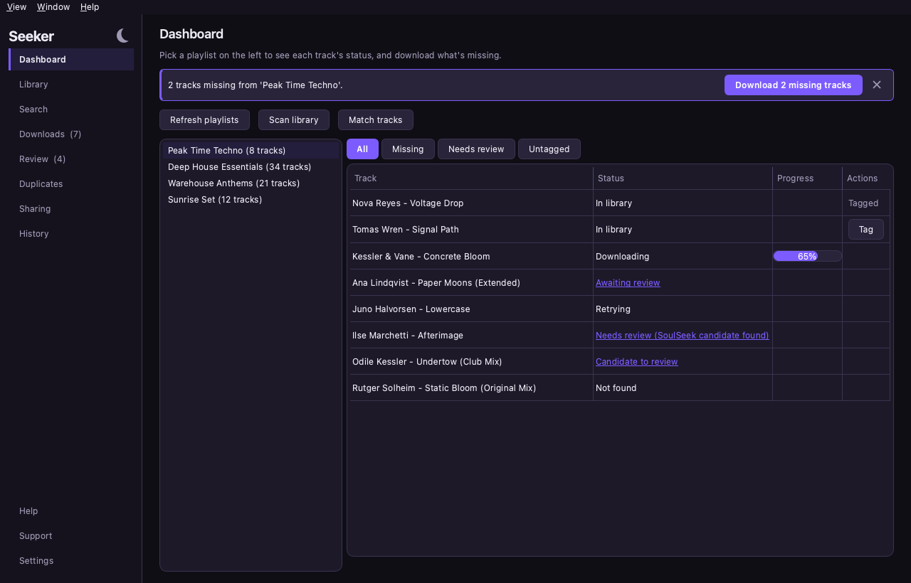 | 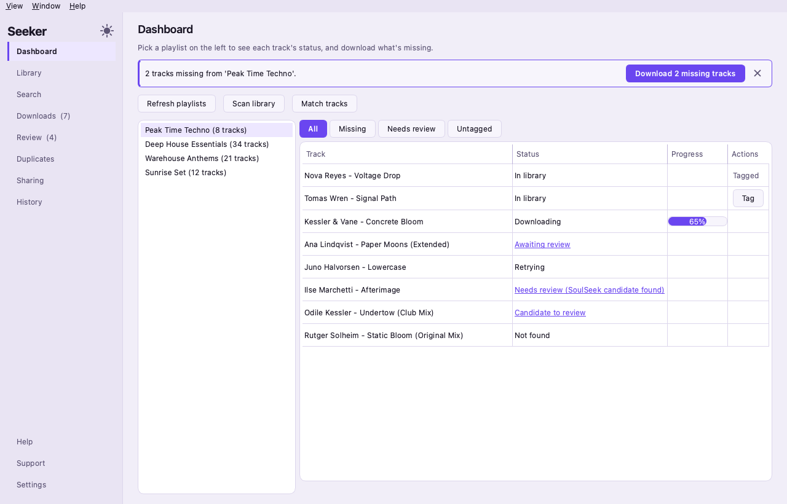 |

---

## Direction A — "Booth"

**Idea.** The DJ booth's own hardware vocabulary. A CDJ tells you its
state with lit buttons, LEDs and meters, readable at a glance in the
dark. Seeker's track states map onto that vocabulary directly:

| Booth signal | Seeker state | Mark |
|---|---|---|
| Play, lit green | In library | solid green LED |
| Cue, lit amber | Downloading, Retrying (working) | solid amber LED |
| Cue, ring | Awaiting review, Needs review, Candidate to review (waiting on you) | amber ring |
| Unlit, red | Not found | solid red LED |
| Level meter | Download progress | segmented amber meter, percentage beside the LED |

The surfaces are neutral graphite (no hue tint). The one accent is the
blue of a waveform display: selection, focus, the one primary button
(lit, with dark text, like a backlit pad). Page titles and the wordmark
use condensed panel lettering. Everything else stays on the system
font.

**Where the boldness goes:** the status column. That column is the
primary job.

| | Dark | Light |
|---|---|---|
| Dashboard | 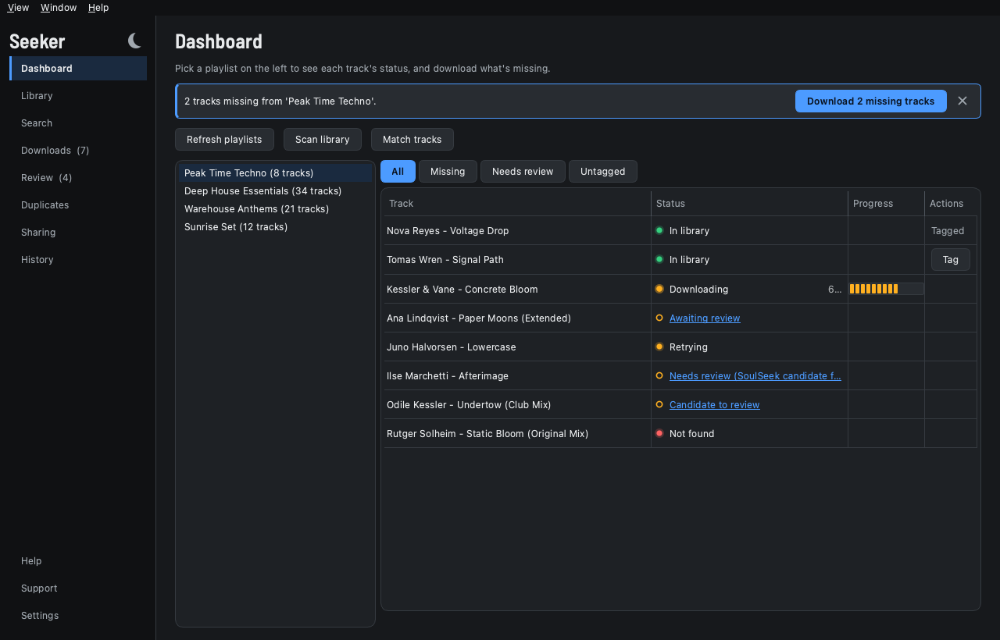 | 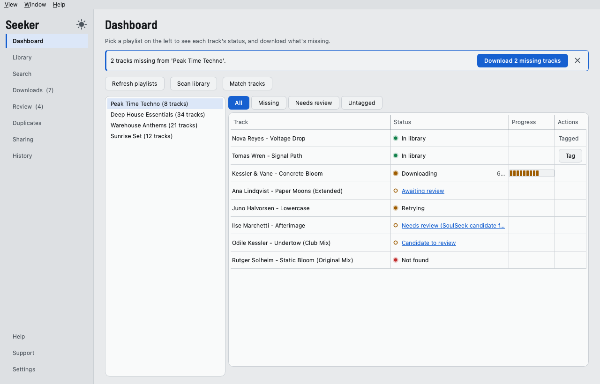 |
| Review | 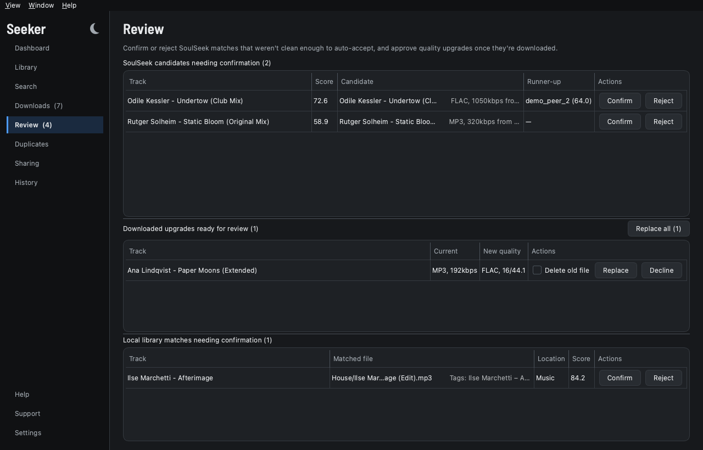 | 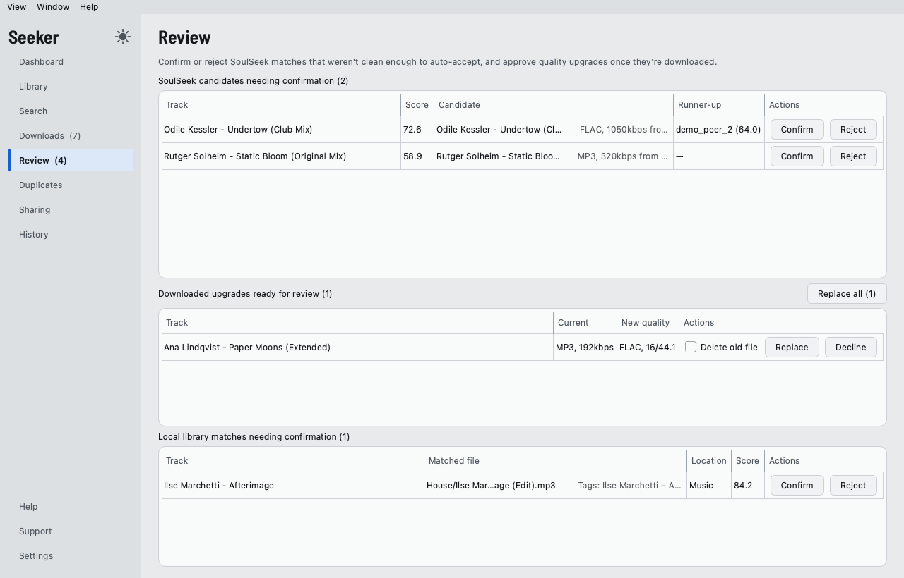 |
| Settings | 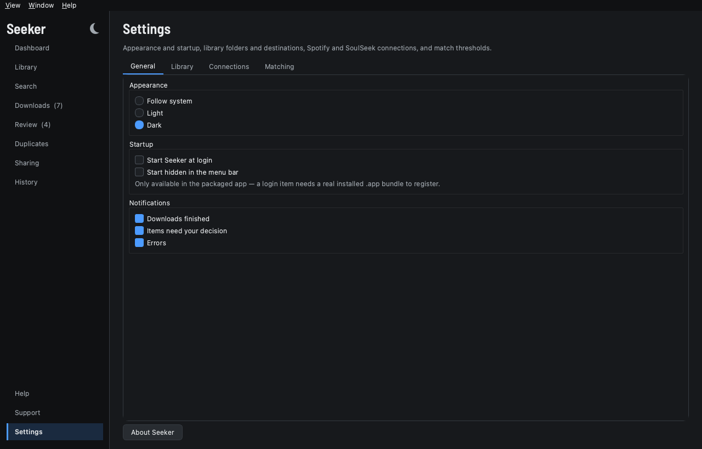 | 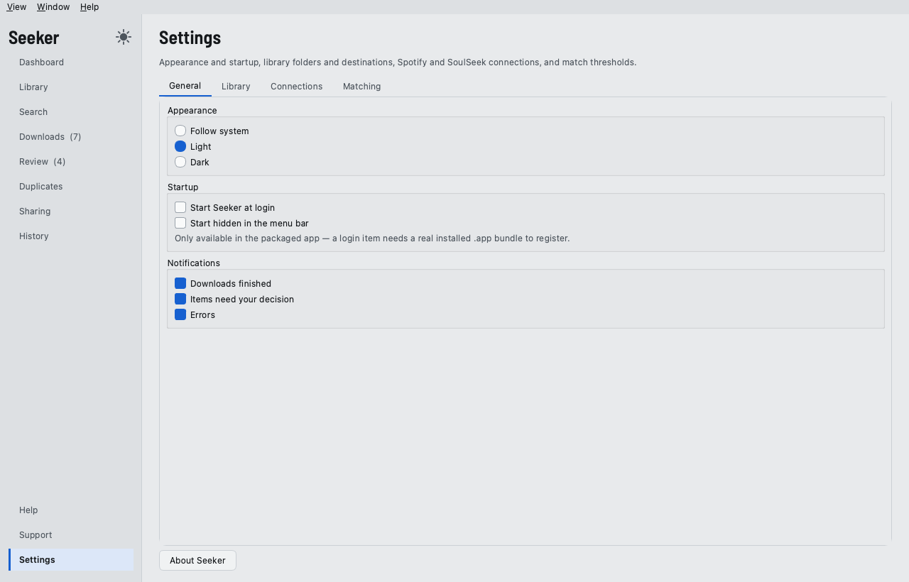 |
| Wizard | 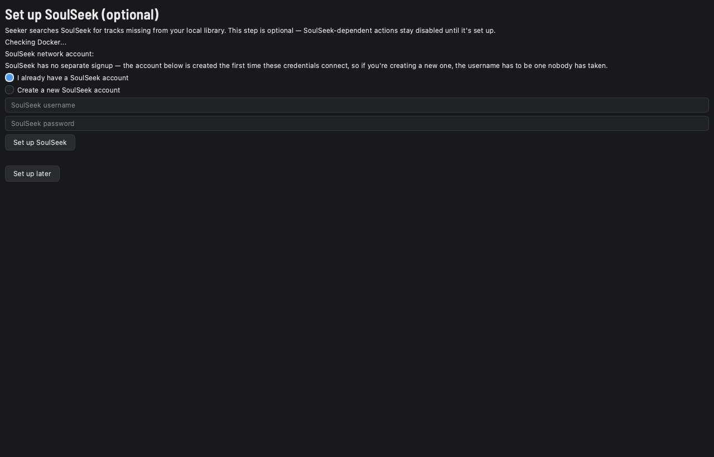 | 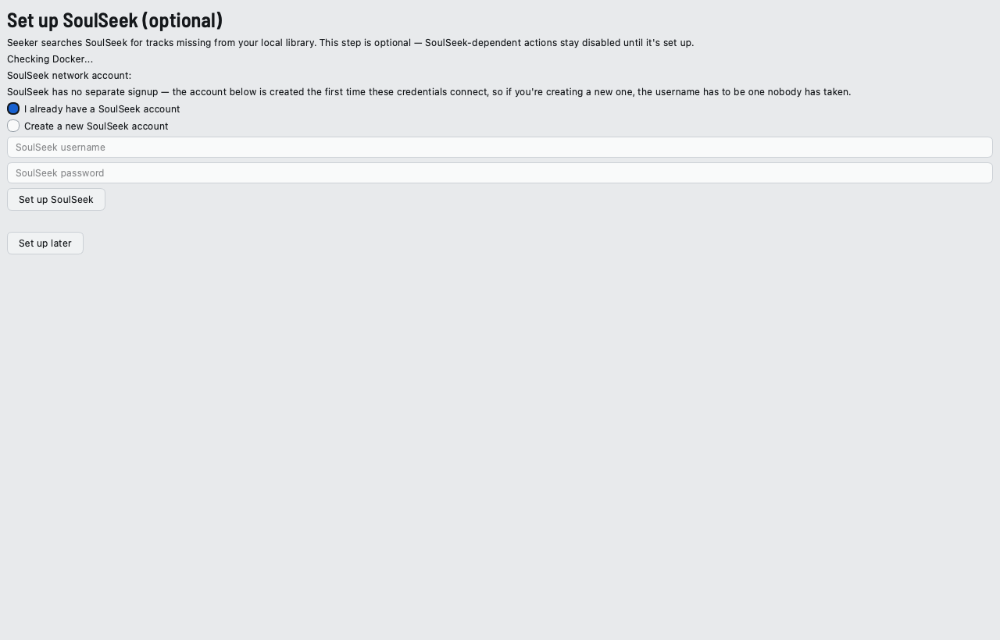 |

### Tokens

| Token | Dark | Light | Role |
|---|---|---|---|
| `BG_APP` | `#17191C` | `#E8EAEC` | page ground |
| `BG_SIDEBAR` | `#101113` | `#DDE0E3` | recessed chrome |
| `BG_SURFACE` | `#1E2125` | `#F9FAFA` | cards, tables |
| `BG_SURFACE_2` | `#282C31` | `#F0F2F3` | raised controls, meter track |
| `BORDER` / `BORDER_STRONG` | `#353A40` / `#4C535B` | `#CBD0D5` / `#9BA3AB` | |
| `TEXT` / `TEXT_MUTED` / `TEXT_FAINT` | `#E8EAEC` / `#A0A7AE` / `#737B83` | `#15181B` / `#4D555D` / `#757D85` | |
| `ACCENT` (waveform blue) | `#4C9BFF` | `#1660D0` | selection, focus, primary |
| `ACCENT_HOVER` / `_PRESSED` / `_SUBTLE` | `#6AADFF` / `#3484EE` / `#1A2A3F` | `#0F53B8` / `#0B479E` / `#DCE7F8` | |
| `ON_ACCENT` | `#0A1422` | `#FFFFFF` | text on a lit fill |
| `SUCCESS` (play) | `#35D07F` | `#11804A` | in library |
| `WARNING` (cue) | `#FFB020` | `#9E5C00` | working / waiting on you |
| `DANGER` | `#FF6363` | `#C22B2B` | not found, failures |

`ON_ACCENT` is dark text in dark mode. The lit blue is too light for
white (white on `#4C9BFF` is 2.82:1), and a lit hardware pad
reads as light with dark lettering anyway. That breaks the field's
current "always white" note, which S31 would rewrite.

**Type.** Barlow Semi Condensed (OFL 1.1, Google Fonts), two weights
bundled (Medium, SemiBold, ~105 KB each).

| Role | Face | Size / weight |
|---|---|---|
| Wordmark, page title | Barlow Semi Condensed | 26 px / SemiBold |
| Section header | Barlow Semi Condensed | 16 px / SemiBold |
| Body, tables, controls | system UI font | default size, regular |
| Secondary cell text, badges | system UI font | as today (`SECONDARY_ROLE`, badge scale) |

**Spacing** stays 4 / 8 / 12 / 16 / 24. **Radius** tightens toward
hardware: controls 4 px, cards 6 px, meter 2 px with 1 px segments.
The mockup changed only the meter's radius. The others are this
document's proposal.

---

## Direction B — "Harmonic"

**Idea.** Seeker already computes Camelot keys and BPM. Make the
Camelot wheel's twelve hues the one bold element: a key pill on each
track row (key in its wheel colour, BPM beside it on a neutral half),
and a small wheel beside the wordmark. Everything else is quiet: cool
ink neutrals and one pale steel-blue accent.

The wheel is Seeker's own, not Mixed In Key's exact colours. Adjacent
Camelot numbers (the compatible mixes) get adjacent hues, 1 at
turquoise, stepping 30° around the wheel. Every fill is solved to the
**same** contrast (7.0:1) with the pill's text, so no key shouts louder
than another. In light mode each fill gets an edge in its own hue at
3:1 on white, or the pale fills vanish into the surface.

| | Dark | Light |
|---|---|---|
| Dashboard | 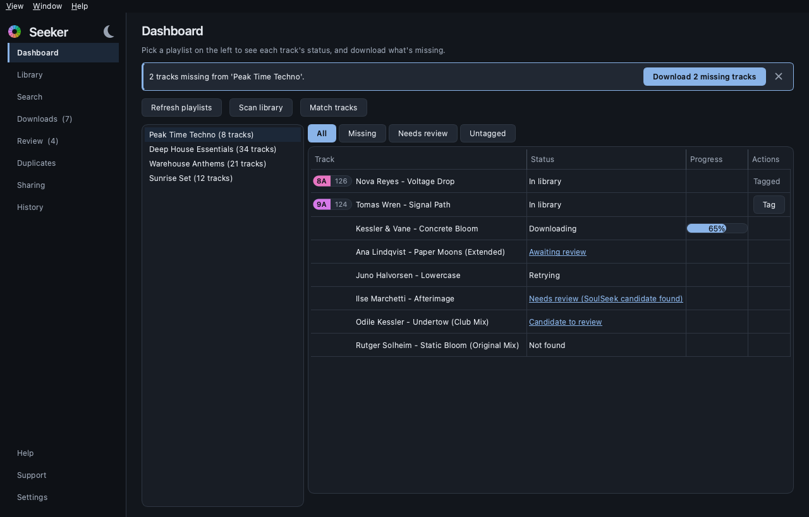 | 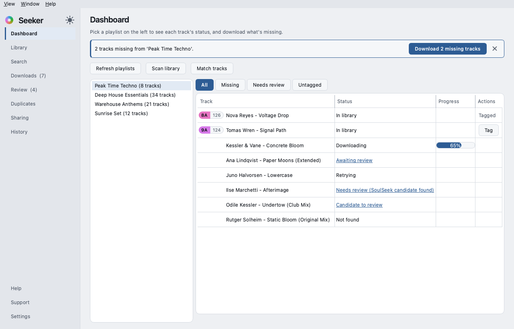 |
| Review | 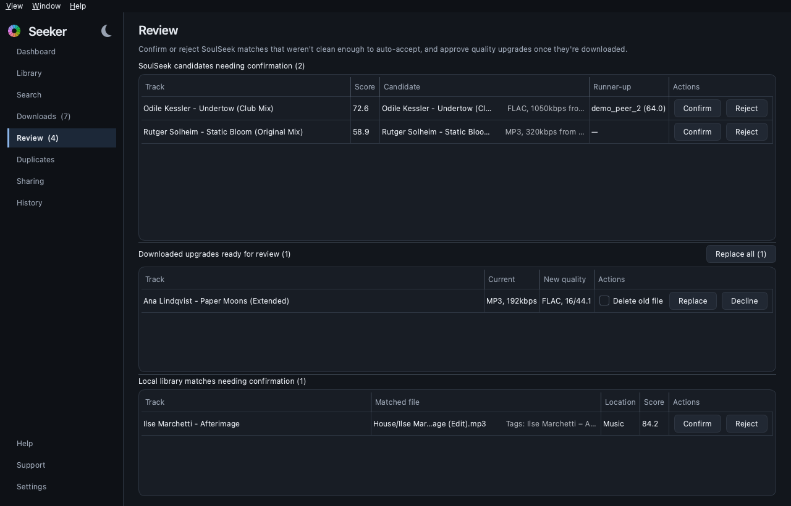 | 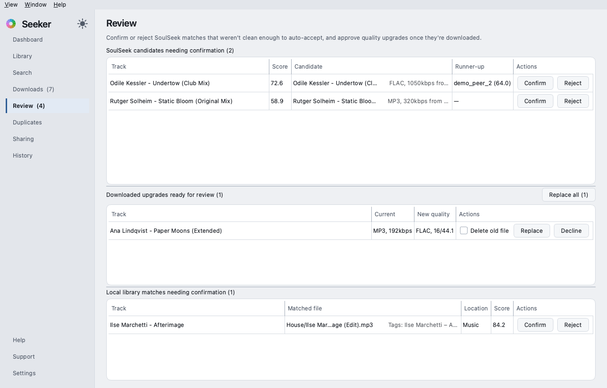 |
| Settings | 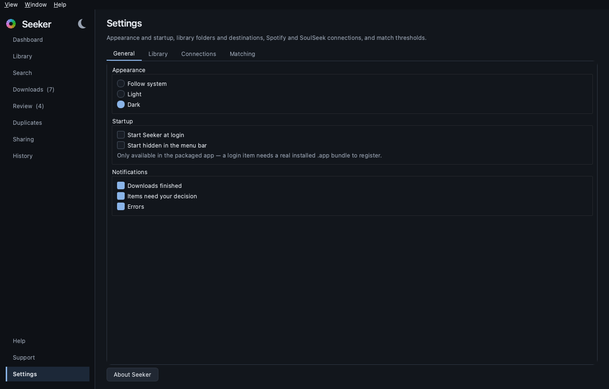 | 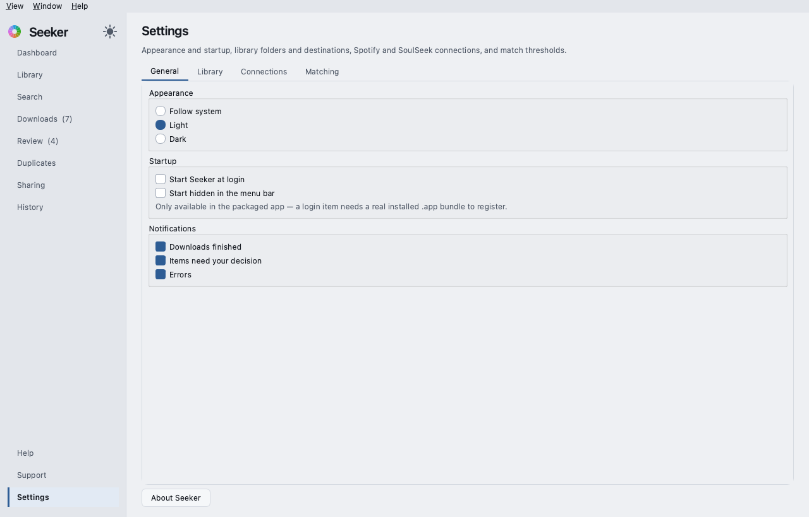 |
| Wizard | 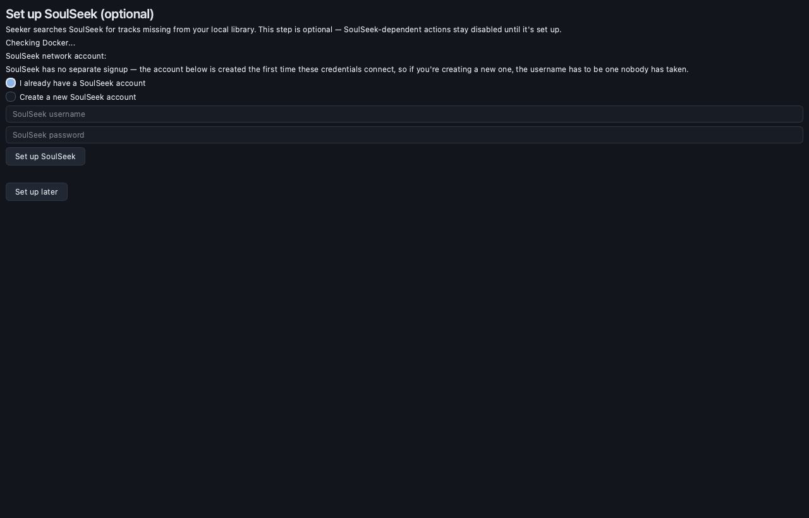 | 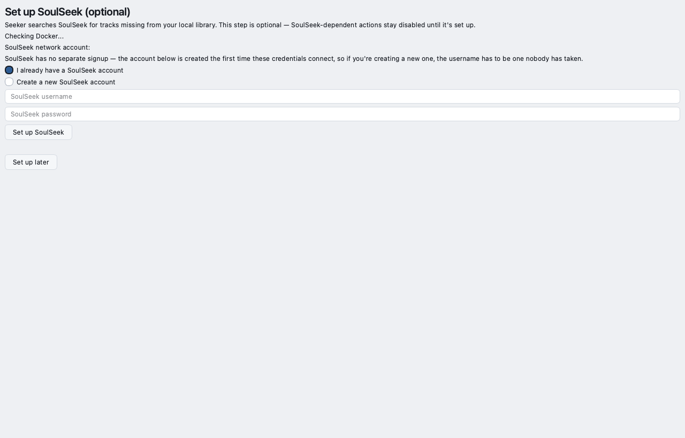 |

Every pill, both themes, and the wheel mark:

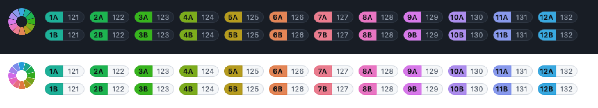

### Tokens

| Token | Dark | Light |
|---|---|---|
| `BG_APP` | `#12161C` | `#EEF0F3` |
| `BG_SIDEBAR` | `#0E1116` | `#E3E6EB` |
| `BG_SURFACE` | `#181D25` | `#FFFFFF` |
| `BG_SURFACE_2` | `#212833` | `#F5F7F9` |
| `BORDER` / `BORDER_STRONG` | `#2E3642` / `#47515F` | `#D5DAE1` / `#A3ACB9` |
| `TEXT` / `TEXT_MUTED` / `TEXT_FAINT` | `#E4E8EE` / `#98A2B1` / `#6F7988` | `#161A21` / `#515A68` / `#7A8392` |
| `ACCENT` (steel blue) | `#8AB4E8` | `#2D5C94` |
| `ACCENT_HOVER` / `_PRESSED` / `_SUBTLE` | `#A0C3EE` / `#729FD6` / `#1C2838` | `#244E80` / `#1C416C` / `#E2EAF4` |
| `ON_ACCENT` | `#0E1116` | `#FFFFFF` |
| `SUCCESS` / `WARNING` / `DANGER` | `#5CC98E` / `#E2B354` / `#F07070` | `#1F7A4D` / `#965800` / `#B53030` |
| Key pill text | `#0E1116` | `#0E1116` |

The twelve key fills (both themes) and light-mode edges:

| Camelot | Fill | Text on fill | Fill on dark `BG_SURFACE` | Light edge | Edge on white |
|---|---|---|---|---|---|
| 1 | `#1DB198` | 7.02 | 6.28 | `#1BA790` | ≥3.0 |
| 2 | `#1DB450` | 6.93 | 6.20 | `#1CAC4C` | ≥3.0 |
| 3 | `#37B41D` | 6.94 | 6.21 | `#34AC1C` | ≥3.0 |
| 4 | `#7CAC1C` | 7.00 | 6.26 | `#75A21A` | ≥3.0 |
| 5 | `#B69C1E` | 6.99 | 6.25 | `#AC941C` | ≥3.0 |
| 6 | `#E38556` | 6.98 | 6.25 | `#E17944` | ≥3.0 |
| 7 | `#EA7C8E` | 7.00 | 6.26 | `#E86F83` | ≥3.0 |
| 8 | `#E875C2` | 6.98 | 6.25 | `#E667BC` | ≥3.0 |
| 9 | `#D779E9` | 7.03 | 6.28 | `#D26CE7` | ≥3.0 |
| 10 | `#AC8DEC` | 7.00 | 6.26 | `#A583EB` | ≥3.0 |
| 11 | `#8899EC` | 7.04 | 6.30 | `#7D90EA` | ≥3.0 |
| 12 | `#39A8DF` | 7.06 | 6.32 | `#259EDB` | ≥3.0 |

The edge hexes above were solved at a 3.0 target, and the committed
scratch module now solves at 3.05 so the rounded value clears 3.0; S31
regenerates the exact hexes from it. The cost of equal luminance:
greens and yellows (3–5) come out olive and mustard, not bright. That
is the price of keys 10 and 11 reaching AA at all. At a fixed
lightness they were 4.09:1 and 4.37:1.

**Type.** System UI font throughout, titles at 20 px SemiBold. No
bundled face: the colour is the identity, and the type stays out of
its way. **Spacing** unchanged. **Radius** unchanged (6 / 10), pills
fully rounded (9 px).

---

## Contrast (WCAG 2.x, `theme.contrast_ratio`)

Floors are the ones `tests/test_theme.py` enforces, raised to 4.5 for
the two accent pairs that carry text. ✗ marks a pair below its floor.

| Pair | Floor | Current dark | Current light | Booth dark | Booth light | Harmonic dark | Harmonic light |
|---|---|---|---|---|---|---|---|
| TEXT / BG_APP | 4.5 | 16.09 | 15.31 | 14.60 | 14.78 | 14.76 | 15.28 |
| TEXT / BG_SURFACE | 4.5 | 14.41 | 17.54 | 13.40 | 17.04 | 13.76 | 17.44 |
| TEXT / BG_SURFACE_2 | 4.5 | 12.52 | 16.22 | 11.65 | 15.87 | 12.06 | 16.24 |
| TEXT_MUTED / BG_SURFACE | 4.5 | 6.21 | 7.06 | 6.64 | 7.24 | 6.56 | 6.97 |
| TEXT_FAINT / BG_SURFACE | 3.0 | 3.31 | 3.62 | 3.76 | 3.99 | 3.84 | 3.83 |
| BORDER_STRONG / BG_SURFACE | 1.9 | 1.98 | 1.94 | 2.07 | 2.44 | 2.10 | 2.29 |
| ON_ACCENT / ACCENT | 4.5 | 4.35 ✗ | 5.60 | 6.55 | 5.80 | 8.80 | 6.84 |
| ACCENT / BG_SURFACE (link text) | 4.5 | 3.95 ✗ | 5.60 | 5.73 | 5.55 | 7.87 | 6.84 |
| ON_ACCENT / DANGER | 3.0 | 3.91 | 5.56 | 6.35 | 5.72 | 6.53 | 6.12 |
| SUCCESS / BG_SURFACE | 3.0 | 7.33 | 4.66 | 8.07 | 4.77 | 8.22 | 5.32 |
| WARNING / BG_SURFACE | 3.0 | 7.75 | 4.99 | 8.84 | 5.04 | 8.71 | 5.69 |
| DANGER / BG_SURFACE | 3.0 | 4.39 | 5.56 | 5.55 | 5.47 | 5.85 | 6.12 |

Both directions clear every floor in both themes, and both fix the
current theme's two failures. The status colours clear 3:1, the floor
for a non-text mark (WCAG 1.4.11), in every case. They also clear 4.5, so
any of them can be text (a badge label). Today's dark `DANGER` does
not (4.39).

**Colour is never the only signal.** In Booth the LED always sits
beside its text label, and lit versus ring is a shape difference, not
just a hue. Green, amber and red are the pairs a red–green colour-blind
user confuses most. In Harmonic, the key's text is always on the pill.

---

## Icon set (both directions)

**Lucide** (ISC licence: bundle and modify freely, keep the notice).
It uses one 24 px grid, a 2 px round stroke and one weight, which suits
a quiet sidebar in either direction. Phosphor (MIT) is the alternative.
Its six weights would give a filled icon for the active page, which
Lucide cannot, but it is a larger set to vet. Proposed mapping, names
to confirm against the release S32 vendors:

| Page | Lucide icon |
|---|---|
| Dashboard | `layout-dashboard` |
| Library | `library` |
| Search | `search` |
| Downloads | `download` |
| Review | `list-checks` |
| Duplicates | `copy` |
| Sharing | `share-2` |
| History | `history` |
| Help | `circle-help` |
| Support | `life-buoy` |
| Settings | `settings` |

Lucide ships `stroke="currentColor"`. Qt's SVG renderer has no current
colour, so S32 recolours each icon per palette at load time, the way
`combo_chevron_path` already keeps one file per palette. This needs
Qt's `qsvg` plugin in the bundle, already a live check for the chevron
(HISTORY §174).

---

## BPM and key on the Dashboard: what the real data says

Analysis (BPM, Camelot key) runs only on a local file, and only when
it is tagged with the analysis option on (`analyze_audio`, default
off, in `metadata_service.py`). Read-only on the real database
today: **3 of 6,921 local files have a key or BPM.** A missing track
has none by definition, so the rows the Dashboard exists for (the
missing ones) are always blank. In the demo, six of eight rows are
blank. Spotify's audio-features endpoint, the only other source,
closed to new apps in November 2024 (from memory, UNVERIFIED here).

So on the Dashboard, Harmonic's one bold element is absent from the
primary job's rows, and from almost every row in the real library
until analysis runs at scan time. That would be a separate feature,
with librosa running over every file, and it is not in the brief.

---

## Recommendation

**Booth, without BPM and key on the Dashboard.**

- Booth spends its boldness on the status column, and that column *is*
  the primary job. It reads in a dark room at a glance, and it improves
  every row that has ever existed. Harmonic spends its boldness on data
  that is blank for missing tracks, and for 99.96 % of the real library
  today.
- Booth is grounded in the user's own hardware, not in the app's
  internals. Amber-for-working, green-for-in-library needs no legend
  for a DJ.
- The cost is real but bounded: one bundled OFL face (two weights),
  LED icons in one column, and a per-instance meter stylesheet. Each is
  a pattern the codebase already has (`_MEIPASS` resources, per-palette
  icon files, `style_determinate_progress_bar`).

**If you want key and BPM visible somewhere,** the Harmonic pill would
fit Library's tag results and Review's candidates better, where a file
exists. Doing that well needs analysis at scan time first. That would
be its own row after v0.1.0, not part of this refresh.

**Not recommended: a straight mix** (Booth's LEDs plus Harmonic's
coloured keys on one table). Twelve key hues beside three status hues
gives two competing colour systems on one row, which is exactly what
"spend boldness in one place" rules out.

### Found while rendering (affects S34 if Booth or Harmonic is chosen)

- A decoration icon in a cell is not counted by the column fit or by
  `ElidedTextDelegate`'s secondary-text budget. With the LED, "Needs
  review (SoulSeek candidate found)" elides at 1280 px. With a key
  pill, a `SECONDARY_ROLE` "126 BPM" elided to "…". `fit_widths` and
  the delegate need the icon's width.
- The wizard's step headings are `<h2>` rich text inside 9 px margins,
  outside the page-title QSS role. The mockups preview them in the
  title role; S33 makes that real.

### Reproducing the mockups

`visual-direction/scratch/` holds the monkeypatch module that rendered
every image: `direction.py`, the palettes and painters;
`render.py`, the harness driver; and `wheelsheet.py`, the pill sheet.
It changes no repository file at runtime. To re-render, put the two
Barlow Semi Condensed TTFs in `scratch/fonts/`, then:

```
SEEKER_SCRATCH_DIRECTION=booth uv run python docs/design/visual-direction/scratch/render.py <out-dir>
```

It is reference material for S31, not product code: it reaches into
private names, and `ruff`/`mypy` do not cover it.

---

## Decision

*Pending: Kris's answer goes here (direction, any mix, and whether the
Dashboard shows BPM and key), with the date. S31 starts from it.*
