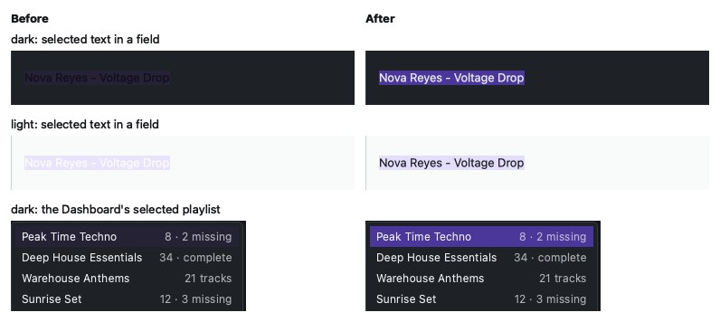
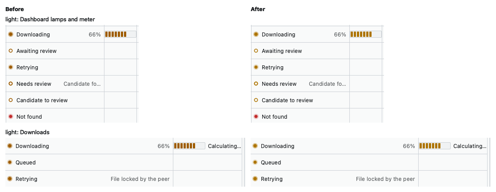
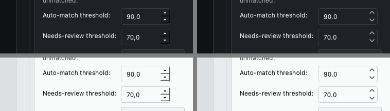

### 181 — Round 11 S31 (§31.1–§31.4): Booth violet tokens; `active_palette()`; Barlow Semi Condensed; status lamps; a checkbox tick

**Decision this builds on.** Kris picked Booth with the violet accent
(A′) on 2026-10-07, with no BPM or key on the Dashboard (§180;
`docs/design/visual-direction.md` → Decision).

**§31.1 (`9ba724f`), tokens.** `DARK` and `LIGHT` take the document's
A′ values: graphite surfaces, a lit violet `#9A7DFF` under dark text in
dark mode, a deep `#6440E6` under white in light, CDJ-lamp status
colours. Radii tighten to controls 4 px and cards 6 px; the combo
chevrons are redrawn in the new `TEXT_MUTED`. New contrast floors in
`tests/test_theme.py`: `ON_ACCENT` at 4.5 on rest, hover and pressed;
`ACCENT` at 4.5 as link text on a surface and the page ground;
`TEXT_MUTED` at 4.5; each status colour at 4.5 on a surface and 3.0 as a
mark on the page ground and a selected row (`ACCENT_SUBTLE`); the
native `HighlightedText` at 4.5 on `Highlight`. Before: the old
palettes failed eight of the new cases (seven dark, one light).
`HighlightedText` was `TEXT`, under 3:1 on `ACCENT` in both themes; it
is now `ON_ACCENT`. After: all pass. The pre-refactor byte pin on the
old `DARK` became a pin on the approved values for both palettes.

**§31.2 (`1fb03e7`), the accessor.** `_set_module_tokens` reassigned
seventeen module globals on every theme switch. `theme.active_palette()`
now returns the palette `apply_theme` last applied (a one-field holder,
since `PLW0603` rules out `global`). The brief counted 2 production
reads and 34 test reads. Measured: 7 production reads (the empty-state
glyph, two `widgets.py` glyphs, `TwoToneProgressBar`'s label, the
Dashboard's review-link accent twice) plus one inside `theme.py` that a
grep for `theme.X` cannot see (`style_determinate_progress_bar`'s
`{ACCENT}`; ruff's undefined-name check found it once the globals were
gone). Tests: 11 reads and one monkeypatch. The Dashboard's accent is
passed into `_rebuild_track_rows`, so the render key and the rows use
one value.

**§31.3 (`a22e1bd`), the face.** Barlow Semi Condensed Medium and
SemiBold (OFL 1.1, 105 KB and 110 KB) with `OFL.txt`, from
`google/fonts`, in `packaging/fonts/`, added to `seeker.spec`'s datas
and resolved through `bundled_dir()` (the old `_icons_dir`,
generalised). `apply_theme` registers it once per process
(`register_display_font`); an unreadable file is logged and its role
falls back to the system font. Type tokens: `DISPLAY_FAMILY`,
`TYPE_TITLE_PX` 26, `TYPE_SECTION_PX` 16, `WEIGHT_MEDIUM`,
`WEIGHT_SEMIBOLD`. The wordmark and page titles are 26 px SemiBold;
section headers are 16 px **Medium**, which answers S30's open question
(rendered on Sharing's "Currently uploading", it reads as a header
without competing with the title). Tests check the files and licence,
the spec line, the frozen path, both registered styles, the failure
log, and each role's resolved family, pixel size and weight.

**§31.4 (`56e9cf5`), status lamps.** `ui/status_lamp.py`: a `Lamp` is
a palette colour plus lit or ring. `PLAY` (green, lit), `CUE` (amber,
lit: working, queued included), `CUE_WAITING` (amber ring: every state
that waits on you), `FAULT` (red, lit), `STANDBY` (faint ring: a
superseded request). `TRACK_LAMPS` and `DOWNLOAD_LAMPS` cover every
track state and every `DownloadStatus`, and tests fail if a new state
has no lamp. Every lamp clears 3:1 on a row, the page ground and a
selected row in both themes (the lowest, `STANDBY` on light
`ACCENT_SUBTLE`, is 3.37). `lamp_icon` draws the dot or ring at 2x; S34
and S35 place it.

**The checkbox tick (`b803845`).** Assigned to S31 by the decision
document. A checked box was a solid `ACCENT` square. Red: every pixel
inside the indicator was 1.0:1 against `ACCENT`. Now
`check_tick_{dark,light}.svg` draw an `ON_ACCENT` tick, resolved like
the chevron (`_palette_icon` serves both).

**Found: the cell-widget background test is order-dependent on Cocoa,
not intermittent (§177's open question).**
`test_a_cell_widget_paints_the_rows_own_background` passes alone and
fails after any earlier test in the file that shows a window
(bisected: six of the first 13 tests each trigger it alone). The same
pair fails at `860d521`, before any S31 change, with the old palette:
row pixel `(31, 26, 45)` against container `(29, 25, 41)`. The row
pixel is tinted a few units toward the accent, which looks like a
hover or selection state left by the cursor or an earlier window.
UNVERIFIED. Under `QT_QPA_PLATFORM=offscreen` (CI) the file passes.

**Not done here, by design.** The segmented amber meter and the
lamps' placement in cells (S34; the decoration-icon width that
`fit_widths` and `ElidedTextDelegate` must count). The nav icons and
the wordmark treatment (S32). The scratch mockup module under
`docs/design/visual-direction/scratch/` still reads the removed
`theme.WARNING`/`theme.TEXT` globals. It is reference material, outside
ruff and mypy, and was not updated.

### 182 — Round 11 S32: the shell — Lucide nav icons, the brows wordmark, the page header, a cue lamp on the activity strip, notices with a lit edge

Booth violet (A′) applied to the chrome every page shares. Five
commits, each test-first; screenshots of all 72 harness screens
reviewed in both themes at 1280×820 and 960×640.

**Nav icons (`a32d604`).** Lucide (ISC), vendored unchanged from the
npm package `lucide-static` 1.52.0 (integrity hash verified, recorded
in `packaging/icons/lucide/SOURCE.txt` beside the package's own
`LICENSE`). All eleven names S30 proposed exist in that release
unchanged (`layout-dashboard`, `library`, `search`, `download`,
`list-checks`, `copy`, `share-2`, `history`, `circle-help`,
`life-buoy`, `settings`). Lucide strokes in `currentColor`;
`ui/icons.py::TokenIconEngine` (a `QIconEngine`) swaps in a palette
token on every draw: `TEXT_MUTED` off, `ACCENT` on (the checked page),
`TEXT_FAINT` disabled. **Divergence from S30's plan, deliberately:**
not one file per palette like the chevron. A QSS `image:` needs a file;
a `QIcon` does not, and drawing from `active_palette()` keeps the
vendored files byte-identical to upstream, recolours on a theme switch
with no code, and avoids 44 generated files. `QSvgRenderer` comes from
QtSvg, so the nav icons do not depend on the `qsvg` image plugin (the
chevron and tick still do). Red: `ModuleNotFoundError`, then the shell
test `button.icon().isNull()`. New contrast floors: muted labels 4.5
on `BG_SIDEBAR`; an `ACCENT` icon 3.0 on the checked `ACCENT_SUBTLE`
fill.

**The wordmark (`9ff777b`).** The brows over "ee" (Kris's pick, §106)
return. They were deleted in §114 for a bottom-edge clip, caused by
one painted widget drawing both the word and the brows, not for how
they looked. Now `ui/wordmark.py::Wordmark` is the plain
`QLabel#wordmark` (it sizes itself from its own font) with the brows
as a child overlay it never measures, so the clip cannot recur; the
§114 bottom-row pixel test now scans the real `Wordmark`. Geometry is
`seeker_brows.svg`'s centre lines. The SVG's own stroke would be a
1 px hairline at this size, so the brows are drawn with `QPainter` at
0.15 of the x-height, close to the face's stem. Measured, not assumed:
`QLabel` draws Barlow 26 px with its baseline at 26 and the "e" ink
top at 12.5 (an `fm.height()`-centred computation agrees to within
1 px). The first placement (0.2 x-height gap, full "ee" span) touched
the letters and read as accents, "Sèéker". It now spans 0.9 of the
"ee" and stands 0.3 x-height clear, in a 6 px top margin the sidebar
takes back from its own, so the word stays level with the page title.
At 1× (the offscreen harness) the brows are about 2 px tall. At 2×
(a Cocoa grab) they read as brows. Kris has the last word (handoff).

**The page header (`3baaad5`).** Title and subtitle 4 px apart, the
pair 16 px from the content (all three were 12 apart). Subtitles wrap
at ~90 characters (`SUBTITLE_MEASURE_CHARS`): History's ran to ~150 a
line at 1280. Red: a 13 px gap, a 1,052 px subtitle.

**The activity strip (`3e1379a`).** A lit `CUE` lamp before the label
(work in progress is cue). `status_lamp.StatusLamp` is a lamp as a
widget, drawn in the active palette on every paint. The strip's bar
is still the accent: S34's segmented amber meter should cover it.

**Notices (`f10a612`).** The frame is the ordinary `BORDER` hairline,
with only the 3 px left edge in the variant colour (the whole frame
was). Info's edge is `TEXT_MUTED`, not `ACCENT`: the notice's primary
button already carries the accent.

**Not done here.** The nav badges stay text (`"Downloads  (7)"`):
tests and the harness parse that format, and a count pill is its own
change. Settings' subtitle wraps a one-word last line ("thresholds.")
at the 90-character measure; it is copy (S35b).

### 183 — Round 11 S33: the onboarding wizard — one centred column, a step indicator of lamps, numbered Spotify steps, status chips, one primary action, outcomes on a notice

The wizard redesigned in Booth violet. Five commits, each test-first;
every step reviewed in the harness in both themes at 1280×820 and
960×640, plus a scratch render of a rejected login. Wizard tests 33
→ 45; every existing test kept its behaviour, with its widget lookups
updated (`docker_state_label` → `docker_chip`, and the SoulSeek
outcomes `soulseek_status_label` → `soulseek_notice`).

**The column (`f77ab07`).** Content was 9 px from the window edge in
a 520×420 window. It is now a column of at most 560 px
(`COLUMN_MAX_WIDTH`), centred, 48 px down, in a scroll area (the
window opens at 720×700): the wordmark (`ui/wordmark.py`, brows
included), then the step indicator, then the step. Each step is
headed as a shell page is, `#pageTitleLabel` over a muted subtitle
(`_step_page`); `DONE_PAGE_TITLE_HTML` became plain `DONE_PAGE_TITLE`.
A `QStackedWidget` is as tall as its tallest page, so the pages not
shown are made `Ignored` on every step change (`QStackedLayout`'s size
hint skips an `Ignored` page), and a short step never scrolls. Red:
`AttributeError: 'OnboardingWizard' object has no attribute 'column'`.

**The step indicator (same commit).** `ui/step_indicator.py`: the
three steps as lamps on a hairline, in `status_lamp`'s own meanings.
Done is lit `PLAY`; the current step is a `CUE_WAITING` ring (it waits
on you), its label semibold; a step ahead stands by. A skipped
SoulSeek step stays `STANDBY` on the done page. Colour is never the
only signal: label weight changes, and the accessible name reads
"Step 2 of 3: Library" or "Setup complete; SoulSeek (optional)
skipped". Numbers were left off the indicator: the left-to-right
lamps carry the order, and the only numbers in the wizard are the
Spotify instructions'.

**Numbered Spotify steps (`01e403b`).** The one sentence became
three numbered instructions, each beside its control: create an app
(Open Spotify Developer Dashboard), add the Redirect URI (now a
read-only `redirect_uri_field` beside Copy, so it can be selected as
well as copied), paste the Client ID (no client secret). Numbers are
`QLabel#stepNumber`, in the display face. Red: `stepNumber` labels
`[] == ['1', '2', '3']`.

**Status chips (`68ae035`).** `status_lamp.StatusChip`: a lamp and a
sentence in a `CHIP_HEIGHT` pill. Docker: checking (`CUE`), not
installed (`FAULT`), not running (`CUE_WAITING`), running (`PLAY`).
SoulSeek: not set up (`STANDBY`), starting and connecting (`CUE`),
connected (`PLAY`), didn't connect (`FAULT`). The Docker fix-it button
moved into an action row (it was added straight to the vertical
layout; hidden in the harness, so the sizing sweep never saw it
stretch). **A bug found on the way:** a failed bring-up left the busy
bar running, because only the health poll's stop hid it. Red, on the
compose-failure test: `assert wizard.soulseek_progress.isHidden()` →
`False`. `_on_bring_up_failed` hides it.

**One primary action per step (`8e52af0`).** Connect, Choose Folder…,
Set up SoulSeek and Go to Dashboard are `variant="primary"`; Set up
later sits beside Set up SoulSeek. Choose Folder… moved below the two
destination checkboxes, since choosing finishes the step and the
options apply to it; the per-playlist option is indented under the one
it refines. "SoulSeek network account:" became a section header, its
explanation muted. Status lines wrap: an unwrapped one would widen the
column past 560.

**Outcomes on a notice (`75f3cdb`).** The SoulSeek step's status line
carried both progress and outcomes, against the five-channel rule.
Progress stays there; every outcome goes on `soulseek_notice`
(`_show_soulseek_outcome`), and the raw log line behind a rejection
stays on hover (`plain_tooltip(detail or "")`; the plain-text sweep
rejects a conditional around it). A new attempt dismisses the last
outcome. The Spotify and Library steps keep their status labels: both
are written by helpers shared with Settings
(`SpotifyAuthorizationWait`, `pick_and_add_library_location`).

**Already true before this row.** The audit's "every button is full
width" was fixed by S27's `action_row` (§174), and its "the SoulSeek
copy mentions the CLI" no longer holds: no wizard string or tooltip
mentions it.

### 184 — Round 11 S34 part 1: the Dashboard — status lamps in the table, a segmented amber meter, playlist counts, three delegate fixes

The Dashboard half of §34, in Booth violet. Eight commits, each fix
test-first; reviewed in the harness in both themes at 1280×820 and
960×640. Library (the tag-state track list and its styled groups) is
part 2. Dashboard tests 76 → 84; elided-text tests 11 → 14.

**Lamps in table cells (`8140b0f`).** The Status column's text gets
its `status_lamp.TRACK_LAMPS` lamp as the item's icon (the table's
icon size is `LAMP_SIZE`). The review states lose the underlined
accent: their ring already says they wait on the user, and the
double-click tooltip stays. A found candidate ("Candidate found") and
a download's percentage are `SECONDARY_ROLE` text, and the Dashboard
sets `set_secondary_min_share(track_table, 0.0)`: a status label reads
in full and its note gives way, where elsewhere secondary text keeps
45 % of the cell. The rebuild key (`_RenderedRows`) is now the whole
`Palette`, which the lamps bake in, instead of the accent. Red: 11
tests, e.g. `test_each_status_shows_its_lamp_beside_its_label`.

**Three delegate fixes on the way (`elided_text.py`).**
- *An icon was not counted* (`56b8a18`). `_secondary_share` measured
  the primary text from the cell's left edge, so secondary text took
  the lamp's width and the primary elided while the secondary had room
  to give. `_icon_width` reads the text rect's offset from the style.
  Red: `assert (396 - 127) >= 278`.
- *The right margin was not asked for* (`4ae6879`). The paint area
  leaves 6 px at the right that `_secondary_width` never included, so
  "65%" elided to "6…" in a wide cell (the mockup's "6…", which
  `docs/design/visual-direction.md` blamed on the icon; it was this). The area moved to
  `_secondary_area` so a test can measure it. Red: `assert 21 >= 27`.
- *Whole pixels against fractional ones* (`c41822c`).
  `horizontalAdvance` rounds and `elidedText` does not, so an area
  exactly the rounded width still elided "66%" to "66…". The width is
  now `ceil(QFontMetricsF.horizontalAdvance)`. Red, asked of
  `elidedText` itself: `'66…' == '66%'`.
`fit_widths` needed nothing: `sizeHintForColumn` goes through the
delegate's `sizeHint`, which already includes the decoration.

**The strip's busy bar (`bae6ef7`), a bug found on the way.** Once the
activity strip showed determinate progress, its bar kept the
per-instance `::chunk` sheet, so the next indeterminate state painted
a static block, the "stuck at 100%" `_progress_qss` warns about.
`theme.set_indeterminate` clears the sheet with the range. The
selector-less-sheet sweep now accepts `""` (no declarations, nothing
to cascade). Red: `'chunk' not in 'QProgressBar::chunk {…}'`.

**The meter (`2f68c98`).** `theme.style_meter`: cue-amber segments
(`WARNING`, the working lamp's colour; `METER_SEGMENT_WIDTH` 5 px,
1 px gaps, `METER_RADIUS` 2 px), no label, an empty format. The
Dashboard's meter is `METER_WIDTH` 72 px, so Progress fits its header
and Status gains ~30 px at 960; its percentage is the status cell's
secondary text. The strip's determinate progress uses it too.
Downloads keeps `style_determinate_progress_bar` and its labelled
`TwoToneProgressBar` (S35a). The empty format matters to
`test_progress_text`'s sweep, which measures any bar whose `text()`
is non-empty: a hidden label still formats "50%".

**Playlist counts (`bb24f84`, `c79e3a3`).** `MISSING_STATES` names the
pair the CTA and the Missing filter each spelled out.
`DashboardService.get_playlist_summaries()` returns a
`PlaylistSummary` per playlist: a loaded one's cached track count and
missing count, from the same `_compute_status` the table shows, read
by id (Spotify allows two playlists one name; red on a by-name read:
p2 counted p1's track); a never-loaded one keeps Spotify's count and
no missing count (HISTORY §141: it is never fetched). Rows read
"8 · 2 missing", "34 · complete" or "21 tracks", the name as the
row's text and the counts as secondary text. The real database has
215 playlists, 6 loaded (read-only), so most rows show "N tracks".
The summary costs one status read per loaded playlist, so it runs on
load and after a scan or match (`_refresh_playlist_counts`, in place
by id: `_populate_playlists` calls `clear()` with signals live, which
drops the selection). The polled playlist's row updates from the
poll's own statuses, keyed by the id the poll fetched, so a result
landing after the selection moved updates its own row.

**The primary action was already there.** The next-step notice's
button is the page's one accent button, and the action row's own
Download hides while the notice offers it (HISTORY §65). No second
primary was added.

**Found, not fixed.**
- Refresh playlists drops the selection: `_populate_playlists`'
  `clear()` fires `currentItemChanged(None)` into the shared
  selection. Pre-existing; a `blockSignals` and a re-highlight by id
  would keep it.
- `poll_selected_playlist` renders a result fetched before a
  selection change into the table for one tick. Pre-existing and
  self-correcting; the counts are already keyed by id.
- Light mode's lit lamps read muddy at 1× (the halo's alpha over a
  light ground); judge on a 2× grab before changing `_HALO_ALPHA`.

### 185 — Round 11 S34 part 2: Library — a tag-state track list over a new `local_files.has_art`, action groups as titled cards

The Library half of §34. Three commits, test-first; reviewed in the
harness in both themes at 1280×820 and 960×640. Library tests
37 → 42.

**Whether a file has cover art (`108221e`).** Nothing stored it:
`local_files` had `tagged_at`, `tracks` had Spotify's
`album_art_url`, and a tag run's "tagged without art" was never
persisted. Reading tags per file on every Library visit was rejected
(a mutagen read per row, from an external drive, on each playlist
switch); the fact belongs to the file and the scanner already opens
every file it indexes. So `local_files.has_art INTEGER`: 1/0 from the
last read, NULL until a read succeeds.
- The scanner reads it with a second, non-easy `MutagenFile` open
  (the easy interface hides pictures) through
  `audio/tags.read_embedded_art`; any failure is NULL, never 0, so an
  unreadable file is not offered as a cover-art repair.
- A row whose file is unchanged but whose `has_art` is NULL is read
  again and counted as unchanged. That is the backfill: the migration
  leaves every existing row NULL, and the first scan after the
  upgrade reads art once for each file.
- Tagging sets it when the art step wrote a picture; an art step that
  wrote nothing leaves it alone (the file may keep the picture it
  had). Fix missing cover art sets it after embedding and on
  "already correct". The scanner is still the only `upsert` writer,
  so `has_art` is part of its `ON CONFLICT DO UPDATE`.
- Two scale tests counted `MutagenFile` calls per file and now expect
  two (text tags, then art).
- Rehearsed on a copy of the real DB (§0.7): 6,921 files, 27 tagged,
  51 matches before and after; `has_art` NULL on all 6,921. The real
  migration runs on Kris's next launch, and the next scan then reads
  every file's art once.
Red: `AttributeError: 'LocalFile' object has no attribute 'has_art'`
(scanner, tagging, fix-art) and `IndexError: No item with that key`
(the migration).

**The status carries it (`4e9dd67`).** `TrackStatus.has_art`, set for
`IN_LIBRARY` from the matched file, as `tagged_at` already was.

**The track list and the cards (`d68c187`).**
- The selected playlist's in-library tracks (the only ones tagging
  acts on) with a Tags lamp (Tagged, lit green; Not tagged, amber
  ring) and a Cover art lamp (Embedded; Missing; Not checked, standby).
  The secondary text names the fix: "Get from Spotify" when the track
  has no `album_art_url` (Fix missing cover art needs one), "Scan to
  check" when `has_art` is NULL. `set_secondary_min_share(…, 0.0)`, as
  on the Dashboard: the state reads in full at 960.
- The list writes `PlaylistSelection.track_ids`, the seam the
  Dashboard's table writes, never a second one, and shows whatever is
  there: a Dashboard selection appears here, trimmed to the rows the
  list has, with signals blocked so showing it never writes it back
  trimmed. The table work is deferred off `changed` (HISTORY §134);
  the context header still renders synchronously. "Tag selected" reads
  "Tag N selected" (no longer "on Dashboard").
- It reloads when the playlist changes (not on a track-selection
  change), on show (`MainWindow._on_page_changed`), after a theme
  switch (`on_theme_changed`: the lamps bake in the palette) and after
  any run here (`TaggingPanelHost.refresh_track_table` now refreshes
  both tables). A load for a playlist since replaced is dropped.
- Empty states: "Pick a playlist to see which of its tracks are
  tagged." and "None of this playlist's tracks are in your library
  yet…".
- The four groups are cards (`make_card`, a `sectionHeaderLabel`
  title in Barlow, one muted sentence) in a 280 px column beside the
  list, buttons in a `FlowLayout` so they wrap instead of widening
  the column (the first render at 340 px scrolled sideways). Order:
  Tags, Tag options (with its own sentence: they apply to the
  Dashboard's Tag too), Cover art, File names; titles in sentence
  case. The title is the card's accessible name, which the grouping
  test reads. `TagResultPanel` is still built by the panel but placed
  by the page, under the list.

**Found, not fixed.**
- The Dashboard's table does not show a selection made on Library
  (Library shows the Dashboard's). Nothing on the Dashboard acts on
  the shared track selection, so nothing is wrong, only asymmetric.
- The context header still says "Acting on '…' — N tracks in this
  playlist."; the list now shows what it acts on, so the sentence
  could shrink to the name and the Change button.
- Settings still uses Fusion's bare `QGroupBox`; `_action_group`'s
  card is the component to reuse there (S35b).

### 186 — Round 11 S35a: Search, Downloads, History, Duplicates in the Booth language; four pages' outcomes off the status label

The first half of §35. Six commits; each page reviewed in the
screenshot harness in both themes at 1280×820 and 960×640. A
restyle, so the tests that pinned old text were updated with it; the
channel fixes (outcomes leaving the status label) are tested on the
notice.

**Search (`7b8c10b`).** Artist, Title, Search and Download best on one
row; Return in either field searches, refused while a search runs
(`run_busy_worker` has no double-start guard of its own, and Return
still fires while the button is disabled). Results lead with the file
name (`remote_basename`, the peer's whole path as the tooltip), then
Peer, Quality, Size, Score. Quality is one column in Duplicates'
wording ("MP3, 320 kbps"), sorted by `(quality_tier,
effective_bitrate)`, the ranking's own key, so lossless sorts above
any bitrate. A locked file is a `BADGE_ROLE` "Locked" pill, not a
column. The row button is "Download". A download's outcome and every
error, the search's included, went to `search_status_label`, which
the next run wipes; they now go to a new notice through
`FeedbackTarget`.

**Downloads (`fcb9956`).**
- Status carries its `DOWNLOAD_LAMPS` lamp; the label is the
  Dashboard's word where the state is the same ("Retrying" for
  locked). What the label does not say is `SECONDARY_ROLE`: a
  failure's recorded reason, "File locked by the peer", "Stopped
  retrying", a transfer's percentage; the accessible text says it too,
  and a reason keeps its full-text tooltip.
- Progress shows only for `DOWNLOADING`: `style_meter` plus the ETA,
  or, with no bytes yet, `theme.set_busy_meter` (Qt's busy animation
  with the palette's Highlight set to WARNING). A still frame of a
  busy bar is a full bar, which next to a meter reads as "done", so a
  queued row (waiting in the peer's queue, no transfer) has no bar,
  like a locked one. Finished rows lost their redundant full
  "Completed" bar; the green lamp says it, and the sort key still
  ranks them as done.
- `wrap_progress_bar` ends in a stretch: a fixed-width bar without a
  label was centred in its cell while one with a label sat left, so
  a column of meters did not line up (found by the pixel-centring
  test, which samples 10 px into the cell).
- The empty status label held a blank line between the subtitle and
  the table; it now shares the header row. History and Duplicates got
  the same move.
- `tests/shell/test_progress_text.py` measured the labelled bar's
  percentage contrast; no labelled bar is left. `de1a0a5` then removed
  `TwoToneProgressBar`, `style_determinate_progress_bar` and their
  palette test, behaviour-neutral.

**History (`0935911`).** Track reads "Artist - Title", the playlist as
secondary text instead of a parenthetical, with
`set_secondary_min_share(…, 0.0)`: at 960 the default 45 % share cut
the title to "Tomas Wren - Signal Pa…" to show the playlist. A failed
refresh goes to a new notice.

**Duplicates, the channel (`fa4c1a6`).** Results, warnings and errors
(the twelve status-label sites the S34 handoff counted, plus
`run_worker`'s default error text) go to a new notice; the label keeps
"Computing…"/"Searching…". `_render_duplicate_groups` no longer writes
a message (it used to, and the delete handler then prepended its own
result to the text the render had just written); Find reports "Found
N duplicate group(s)", a delete "Deleted: 1, Failed: 0. 2 groups
left." The stress test's diagnostics read the notice.

**Duplicates, the groups (`3574e56`).** Columns: Keep, Path, Location,
Quality, Similarity, Actions. Keep leads, so a group reads as a choice;
Similarity is the group's, so it spans the group's rows as Actions
did; the Group number column goes. Every other group is banded:
`elided_text.BAND_ROLE` makes `ElidedTextDelegate.initStyleOption` set
the option's `backgroundBrush` to the palette's AlternateBase
(BG_SURFACE_2), read at paint time, so a theme switch needs no
re-render (CLAUDE.md: no cached colour). A cell under a cell widget
gets an empty item carrying the role. In dark the band is subtle
(#282C31 on #1E2125), in keeping with graphite. "Resolve all groups"
sits beside the reclaimed-space line above the table: on the controls
row it was clipped at 960. The harness now shows three groups.

**Found, not fixed.**
- At 960 a Downloads failure reason elides to a few characters
  ("The p…"); the full text is on hover and in the accessible text.
  Every column is tight at that width, so no move helps.
- A Duplicates group's first row is taller than the rest: the spanned
  Actions widget's two lines set it.
- History's Detail uses the stored descriptor ("MP3 320kbps"), Search
  and Duplicates "MP3, 320 kbps".

### 187 — Round 11 S35b part 1: Review and Sharing in the Booth language; a reusable disclosure

The first half of S35b, stopped at the row's per-page split point on
budget: Help, Support and Settings are part 2. Three commits; each
page reviewed in the screenshot harness in both themes at 1280×820
and 960×640.

**Review (`a45607e`).** The three section titles take
`sectionHeaderLabel` (Barlow, like Library's cards) and read as a
task: "SoulSeek candidates to confirm", "Downloaded upgrades to
review", "Local matches to confirm", counts unchanged. The subtitle
named two of the three sections and wrapped mid-word ("auto-/match")
at 1280; it now covers all three on one line at 960. The column
budget at 960 was left alone: the Candidate cell elides to a few
characters, but dropping Runner-up (what a Reject falls through to)
would cost the glance more than hover costs the reader.

**Sharing, the layout (`73aafeb`).**
- The five paragraphs that opened the page sit last, behind a "How
  sharing works" disclosure, closed until the viewer opens it and
  remembered in `SeekerConfig.sharing_explainer_open`. Restoring the
  state saves nothing (tested: no `update_settings` call on build).
- `ui/disclosure.py`'s `Disclosure` is a checkable `QToolButton`
  (`#disclosureToggle`: transparent, muted text, Fusion's arrow in the
  text colour, the ACCENT ring on keyboard focus only) over a body
  widget. Its `toggled` fires on a click, never on `set_expanded`.
- Open, the body is a scroll area with the layout's stretch 1, a
  table's share. First tried as a plain label: at 960×640 it crushed
  both tables to one row and clipped its own last paragraph.
- The shares table got a heading ("Your library on SoulSeek"); the
  status label moved into the counts row.
- **Channel fix, test first:** a failed refresh or share went to
  `sharing_status_label` (run_worker's default), which the next
  refresh wipes. On `HEAD` the new test timed out waiting for the
  notice (`waitUntil timed out in 2000 milliseconds`); it now passes
  with `on_error=self.feedback.show_error`.

**Sharing, the rows (`ee85270`).** Shared reads "Shared" (lit green)
or "Not shared" (the standby ring); a shared row's Action cell no
longer repeats "Shared". An upload's slskd flags string becomes
Queued / Uploading / Sent / Failed with its lamp, slskd's reason
("Timed out", "Cancelled", …) as secondary text, the raw state as the
tooltip, and an unknown state as slskd wrote it: a populated upload
has still never been seen live (§62). A theme switch repaints the
lamps from the last snapshot (`SharingPage.refresh_lamps`, called by
`on_theme_changed`) instead of calling slskd; the ETA tracker is fed
once per fetch, so a repaint cannot skew its rate.

**Found, not fixed (part 2).**
- Support's links (the GitHub issue link, the e-mail address) paint
  in pure #0000FF in dark: unreadable on graphite. `QPalette.Link` is
  probably never set by `build_qpalette`; check Help too.
- Review's descriptors read "FLAC, 1050kbps"/"MP3, 192kbps": the
  stored `quality_descriptor` (`download_service.py`), not Search's
  "MP3, 320 kbps". Changing it is a stored-data question, not a
  restyle.

### 188 — Round 11 S35b part 2: Help and Support; links that read; a reading column

The second third of S35b, stopped at the row's per-page split point on
budget: Settings is part 3. Four commits; each page reviewed in the
screenshot harness in both themes at 1280×820 and 960×640, and Help
again at 1280×1300 to see its foot.

**Links (`59e92bd`), test first.** `build_qpalette` never set
`QPalette.Link`/`LinkVisited`, so a `RichLabel` anchor took the
platform's colour. On `HEAD` the new test failed both ways the
platforms differ: offscreen, dark's link was Qt's #0000FF
(`assert 2.0499 >= 4.5` on `BG_APP`); on Cocoa, dark passed (the
platform supplies a light link colour) but light's visited magenta
failed (`assert 2.6003 >= 4.5`). Both roles now take `ACCENT`; the
test passes on both platforms. Support's issue link and e-mail
address were the visible case; Help has no links.

**The reading measure (`df11bc6`, `571e105`, `404c2c4`).**
- `theme.set_reading_measure(label)` replaced Sharing's own
  80-character cap (behaviour-neutral).
- Used per label on Help, it clipped text: a wrapped label capped
  narrower than its vertical layout's row is asked its height at the
  row's width, so it gets too few lines (measured: a label 186 px
  tall that needed 192). It is safe only where the label is a scroll
  area's whole content, as on Sharing; its docstring says so.
- `theme.reading_column(column)` caps the whole column instead, in a
  horizontal row with a spacer: a horizontal layout gives each item
  its real width before asking its height. The column takes the
  stretch factor, or it sits at its size hint and the spacer takes
  every spare pixel (Support wrapped at ~350 px at 960).
- `test_prose_is_never_clipped_by_its_reading_measure` (Help and
  Support) fails on the per-label version (`186 >= 192`).

**Help (`571e105`).** Section titles leave the `<h3>` markup for the
panel lettering; the five steps keep their numbers (a real sequence).
The paths and the build identity sit in one card (muted names,
selectable values) above "Open data folder"/"Open log folder" in an
action row: sentence case, as every other button, and the error hint
that names the button (`error_text.DETAILS_HINT`) follows. The
per-account note is two sentences shorter.

**Support (`404c2c4`).** The "Support Seeker" heading and paragraph
repeated the subtitle; the page is now Donate (one sentence, the two
link buttons) and Other ways to help (report a bug, share back, Go to
Sharing), with the author line muted at the foot.

**Observed, not caused here.** `test_a_cell_widget_paints_the_rows_own_background`
(dark and light) now fails on Cocoa in the full suite: `2 failed,
2006 passed, 1 skipped` here, and `2 failed, 2000 passed, 1 skipped`
on the pre-session commit `4cd9329` run in a worktree the same hour,
where S35b part 1 had recorded `2002 passed`. The same code passed
then, so the change is in the machine, not the tree. The miss is one
channel value (`(249, 250, 250) == (248, 249, 250)`) on a Cocoa grab;
offscreen (CI's platform) it passes. A display colour-profile change
is the suspect, UNVERIFIED.

**Settings, part 3, as seen in the harness:** `QGroupBox` titles in
the system font; the Client ID and destination combos run the full
width; the subtitle wraps at 1280; "About Seeker" floats under the
tab widget; five result labels (destinations, default destination,
Spotify, Test connection, Update credentials) carry outcomes and
errors that `run_worker` wipes, the channel bug §186 and §187 fixed
elsewhere.

### 189 — Round 11 S35b part 3: Settings — titled cards, a reading column, outcomes on notices

The last third of S35b, which closes the row. Five commits; every tab
reviewed in the screenshot harness in both themes at 1280×820 and
960×640, and Library again at 1280×1300 to see its foot.

**The channel fix (`7e22087`, `ff72275`), test first.** Settings
reported outcomes on per-action status labels, the channel
`run_worker` wipes at its next call; Test connection passed no label
at all, so an exception from `check_slskd_health` showed nowhere.
Five new tests (`test_*_is_reported_on_a_notice`, plus the saved
default destination's confirmation) look for the outcome on any shown
`InlineNotice` of the page. On `HEAD` all five failed with
`waitUntil timed out in 2000 milliseconds`; they pass now.
- Library: `locations_notice` became `library_notice` at the tab's
  top (refactor commit), and carries the destination saves too.
- Connections: a new `connections_notice`. The Spotify and
  credentials labels keep their progress through `FeedbackTarget`;
  the destination and Test connection labels, which only ever held
  outcomes, are gone. Validation ("Select a playlist first.") is a
  `warning`, as on every other page.
- `SpotifyAuthorizationWait.start(on_error=)` hears a failed attempt,
  never a cancelled one: "Authorization cancelled." answers the user's
  own click and stays in the status label. The wizard passes none.

**The look (`1f1b6f9`, `28eb690`).**
- `theme.section_card` is Library's job card, moved from
  `tagging_panel._action_group` (refactor). Every Settings
  `QGroupBox` became one: sentence-case title in the panel lettering,
  one muted sentence (`help_text.SETTINGS_*_TEXT`), then the controls.
  No `QGroupBox` is left in `src/`.
- SoulSeek split into the connection (what is configured, Test
  connection) and "SoulSeek credentials" (the update form), which
  replaces the bare "Update credentials:" label.
- General, Connections and Matching sit in `theme.reading_column`;
  Library keeps the width for its locations table.
- Location combos take a name's width (`_location_combo`: 24
  characters); the default destination's form keeps fields at their
  size hint.
- A `QFormLayout` row of `("", empty label)` still takes a line: the
  idle Spotify card had ~40 px of nothing under Re-authorize. Progress
  labels now sit beside their button in the action row, and the
  hidden authorization wait spans its row with no label.
- The subtitle fits one line at 960.

**About (`e711c7c`).** "About Seeker" floated under the tab widget,
outside every tab, duplicating Help → About Seeker. Removed with its
tooltip and `on_about_requested`; `test_menus.py` keeps the menu
route covered.

**Not changed.** Offscreen spin boxes read "90,0": the machine's
locale. Save default destination lost its primary variant, the only
primary save on the page.

### 190 — Round 11 S36: README images and final visual QA

All 19 screens (15 window screens and 4 wizard steps) rendered in
both themes at 1280×820 and 960×640, 76 images from
`tools/screenshots.py`. Every dark image and every light image at
1280 was read, plus light Downloads at 960. Three commits.

**A secondary text with no room for a word (`12f315d`), test first.**
At 960, Downloads' Unavailable row drew its reason as a lone "…".
Downloads gives a status label the whole cell
(`set_secondary_min_share(view, 0.0)`), so the reason got what the
label left: 37 px, a gap and a margin, and an ellipsis. The new
`test_secondary_text_with_no_room_for_a_word_is_left_to_the_hover`
failed on `HEAD` with `assert 37 == 0`. `_secondary_share` now
returns 0 when the room cannot hold the text's first three
characters and "…" (`_SECONDARY_MIN_CHARACTERS`). The full text
stays in the hover. `test_a_view_can_give_its_primary_text_the_whole_cell`
had set a column where the default share gave "65%" less than its
own width, which would have drawn "6…". Its column is now 16 px wider,
so the default share holds the whole percentage, as the test intends.

**Copy (`cb48b02`).** "Choose Folder..." (wizard) and "Container
Path" (Sharing) were the last title-case labels in Seeker's own UI.
Seven progress and button strings used "..." where 45 others use
"…". Log messages keep their text. macOS menu items and dialog
titles ("Focus Search", "Remove Location", "Quit Anyway") keep title
case, the platform's convention for them.

**README images (`c2bc630`).** `--readme` now renders the wizard's
first step too (`README_WIZARD`; `capture_wizard(steps=)`), and the
README's table gains Library and the wizard: six images, all
regenerated from the refreshed UI.

**Left for a row of their own.** Each is bigger than a nit.
- The Downloads header reads "Waiting for transfers to start · 0
  transferring" on the first poll while a row shows 66 % and
  "Calculating…": the aggregate needs two samples, the row's meter
  needs none. In the harness the demo requests also have no `id`, so
  the header never counts them.
- Settings → Library's Reachable column is a bare Yes/No. Every other
  state in a cell is a lamp. A lamp (`PLAY`, and `STANDBY` for an
  unmounted drive, which is out of play rather than a fault) needs a
  repaint hook in `MainWindow.on_theme_changed`, as Sharing's
  `refresh_lamps`.
- Duplicates at 960 elides Quality to "MP3, …" while Path keeps its
  content width.
- Carried, seen again: History's "MP3 320kbps" against Search's "MP3,
  320 kbps" (the stored `quality_descriptor`), the locations table's
  empty space under three rows, and the taller first row in a
  Duplicates group.

### 191 — Round 11 S37: README and developer docs

Finding A-50: a 741-line README (755 by S37) with a static
"tests-1,150" badge, and a project layout kept in both the README and
CLAUDE.md. Three commits, the depth moved before the README was cut,
so nothing was dropped in between.

**`docs/architecture.md`, `docs/cli.md`, `docs/packaging.md`
(`f3578b5`).**
- The module map was regenerated from `find src/seeker`, not copied
  from either old map. Both lacked `library/nesting.py`,
  `login_item.py`, `ui/pages/library_page.py`,
  `ui/playlist_selection.py`, `ui/table_sort.py`,
  `ui/tag_result_panel.py`, `ui/spotify_authorization.py` and
  `models/slskd_start.py`; the README's still listed a
  `ui/formatting.py` (now `seeker/formatting.py`) and a
  `main_window.py` of 1,842 lines (1,229 today).
- The download state machine is drawn (Mermaid) from `schema.py`'s
  own transition list, not from reading the poller: `downloading →
  queued` is not in that list, so it is not drawn; `locked →
  completed`/`ready_for_review` are. GitHub's Mermaid rendering of it
  is UNVERIFIED until the page is viewed on github.com.
- The threading model is condensed from `ui/workers.py`'s docstrings
  (one dispatcher connected once, `task_id`-only signals,
  `setAutoDelete(False)` plus a deferred native delete, worker-side
  throttling) and `MainWindow`'s two timers (2 s, 20 s).
- `cli.md` was checked against `cli.py`'s parser. The old table
  lacked `check [playlist]`, `library scan --match` and
  `downloads review --all`. Two old statements were false:
  thresholds are "hardcoded constants for the CLI" (the CLI's
  `TrackMatcher` gets the same `get_config` as the GUI's, so it reads
  the saved values), and History omits failures because "no failure
  reason is persisted" (`failure_reason` exists since §145; failures
  are on Downloads instead).
- `packaging.md` keeps the Windows and Linux "written, never verified
  on real hardware" labels. The two verification passes of 2026-08-29
  are condensed to their outcomes, with §30, §31, §36, §42, §83
  linked; the old "see CLAUDE.md item 42" pointer is now §42.
- Four packaging files (`seeker.spec`, `seeker.iss`, `build_dmg.py`,
  `build_windows_installer.py`) pointed at the README's packaging
  section; they now point at `docs/packaging.md`.

**The README (`86a69fa`): 755 lines to 178.** What and who, one hero
image (the other five in a `
`, so `--readme`'s six images
stay used), features, install (DMG from Releases or source; Spotify
app, Docker, optional `brew install chromaprint`, which the bundle
does not include), a five-step quick start, an architecture diagram
and four bullets, quality, links. The static tests/mypy/ruff badges
became the live `ci.yml` badge. The tech stack and the design
principles moved to `architecture.md`. CLAUDE.md's one pointer to the
README's command reference now names `docs/cli.md`; the rest of
CLAUDE.md, including its layout copy, is S38's (BRIEF §38).

**The index (`d65e860`).** `docs/README.md` links the three new
documents, `SECURITY.md`, and the three text files shipped with the
app. A script checked every relative link and anchor in the five
touched documents: none broken.

**The numbers, and two failures not from this row.** Local (Cocoa):
`2 failed, 2011 passed, 1 skipped`; both failures are
`tests/test_theme.py::test_a_cell_widget_paints_the_rows_own_background`
(`[dark]` and `[light]`), a one-unit colour difference, e.g.
`(249, 250, 250) == (248, 249, 250)` for column 1. S36 recorded 2013
passed. They fail the same way at `1b415a4`, the commit before this
row, in a clean worktree (`2 failed, 99 passed` for the file), and
pass there under `QT_QPA_PLATFORM=offscreen` (`101 passed`), which is
what CI runs. This row changed only Markdown and packaging comments.
The machine's main display was an external 5K panel during this run;
a different screen's colour space or scale reaching `grab()` would
explain it, but that is UNVERIFIED. mypy clean (138 files), ruff 0.

**Left for later rows.** The README's Releases link and SHA-256 line
describe v0.1.0 as published; S42 makes that true. "Check for
updates…" is not mentioned, since S40 changes it.

### 192 — Round 11 S38: CLAUDE.md refresh — the layout a link, open issues checked against CI, the round's rules added, under 30 KB

**§38.1, the layout (`8b1761b`).** CLAUDE.md's 108-line tree was
stale against the tree (eight modules missing, among them
`library/nesting.py`, `login_item.py`, `ui/pages/library_page.py` and
`ui/playlist_selection.py`; `main_window.py` given as 1,283 lines, now
1,229). It is now a link to `docs/architecture.md#module-map`, the
one map S37 regenerated, plus a seven-line summary.

**§38.2, open issues against CI.** Every CI run on record was read:
187 runs from 2026-09-07 to 2026-10-08, the failing tests taken from
`gh run view <id> --log-failed`. Of the last 50, 48 are green. The
failures, newest first:

| Run(s) | Date | Failing test | Status |
|---|---|---|---|
| `37599402903` (a Dependabot PR) | 10-07 | `test_search_download_best_passes_the_already_fetched_results` | open, below |
| `37517187829` | 10-06 | `test_every_table_keeps_its_primary_column_readable` | fixed, §176 |
| `36843176493` | 10-01 | `test_splitter_sizes_survive_quit_and_relaunch` | fixed, §167 |
| `36690165564`, `36698059243` | 09-30 | Settings credential tests; `already deleted` | fixed, §148 addendum (`245adcb`) |
| `36570098069`, `36580274797` | 09-29 | errors at setup of unrelated tests; `already deleted` | same class, below |
| `35870225354` … `35890158867` | 09-14 → 09-23 | `test_history_refresh_button_refetches`, `test_review_tab_replace_button_…` | fixed, §128 |
| `34478300762` … `34480609277` | 09-10 | `test_close_to_tray_persists_geometry_…` | not seen since |
| `34407483639`, `34407908240` | 09-09 | `test_view_menu_focus_search_…` | fixed, `706f00c` |
| `34205729021` … `34346738383` | 09-08 → 09-09 | `test_callback_server.py` timeouts | fixed, §136 |

What changed in CLAUDE.md's Open issues:

- **Closed: the focus-search flake.** CLAUDE.md still listed it as
  open. `706f00c` (2026-09-10, round 9 §1.3) fixed it:
  `hasFocus()` also needs the window to be the active window, which
  never happens under offscreen QPA (no window manager), so the test
  now asserts `window.focusWidget()`, the property the feature
  promises. 0 failures in the ~150 runs since.
- **Closed: `test_close_event_falls_back_to_real_close_when_no_tray`.**
  Its one CI failure (`36580274797`, 09-29) was not `closeEvent`: the
  log shows `RuntimeError: … QListWidget already deleted` from
  `workers.py`'s `_handle_task_finished`, an earlier test's worker
  finishing after its teardown. `36570098069` (09-29) is the same,
  from `dashboard_page._render_track_statuses` on a deleted
  `QTableWidget`, reported at setup of
  `test_picking_a_playlist_in_library_updates_shared_selection_and_dashboard`.
  §148's addendum fixed the Settings source on 09-30 (`245adcb`); 0
  such errors in the 99 runs since. Whether the Dashboard straggler
  had the same source is UNVERIFIED. The round-8 local occurrence's
  cause stays unknown; if it recurs, start from `closeEvent`. The
  gotcha is now a Testing standing fact.
- **Closed and moved out: the fullscreen-close pair (§130), the S18
  download-button flake (§161), the review/history pair (§128).**
  Each was already in HISTORY; CLAUDE.md kept their narratives.
- **New: `test_search_download_best_passes_the_already_fetched_results`**
  (`37599402903`, Dependabot's uv-build bump, 2026-10-07): `assert
  'Requested from peer1' in ''`. The test waits on
  `download_manual_calls`, which the fake appends on the worker
  thread, then asserts the status label the main thread's finish
  handler writes. That is §128's race shape; UNVERIFIED until a
  delayed fake reproduces it. Not fixed here (a test-first row of
  its own).
- **New: the Cocoa-only theme failure** in the handoff since S37,
  `test_a_cell_widget_paints_the_rows_own_background`. Run alone
  today, `[light]` fails and `[dark]` passes; in the full suite both
  fail, as in S37. The main
  display is still the external LG 5K panel.
- **Kept, re-checked:** items 63, 70 and 125 (no new evidence; item
  70 keeps §22's lead), and the nested locations: a read-only query
  on 2026-10-08 still lists `/Volumes/X9 Pro`, `…/Music` and
  `…/Music/Test` (plus `/Users/sinthesis/Desktop`, not nested).
- **The "CI is real and running" bullet** was a record, not an
  issue. Its one standing fact, why CI skips 29 tests (28
  `@requires_x9_pro`, 1 `@requires_stress_opt_in`), moved to Testing.

**§38.3, the roadmap (`01350db`).** The old brief's "long functions"
item was replaced by what radon measures today: `uvx radon cc -n D
-s src/seeker` lists `dashboard_page._decide_next_step` (D, 21) and
`sharing_service._insert_slskd_share_directory` (D, 26), and the
round's exit criterion allows nothing above C. No row of the plan
owns them. Linux packaging is restated as `docs/packaging.md` has it,
written and unverified.

**§38.4, the round's rules (`71d6449`).** Added with their HISTORY
links: no history in `src/` (BRIEF §0.9, §170), a failing test first
and one change per commit (§0.3–§0.4, §138), real-data safety (§0.7,
§172), the portable Compose template (§140). The error text layer
(§150) and `DownloadStatus` (§153) were already there. Commands gained
CI's exact lint gate, `ruff check src tests tools`.

**§38.5, under 30 KB.** 62,413 bytes at the start of the row (the
brief's 39 KB was the audit's figure; the file grew by a third
since), 53,040 after §38.1–§38.4, **29,794** at the end (`wc -c`). How:

- Every bullet was rewritten as rule, reason, link. What went is
  narrative already in HISTORY: "confirmed live" stories, round
  references, the §6.1 severity note (§116), the "CI is real and
  running" record (§192 above).
- Paired bullets merged: the two `WA_DeleteOnClose` facts, the three
  worker facts, the two Spotify field names, the three QSS traps,
  the three offscreen facts.
- **The UI rules moved to `src/seeker/ui/CLAUDE.md`** (12 KB),
  word for word from the old file: 28 bullets on workers, the window
  lifecycle, rendering, the theme, tables and layout. Claude Code
  documents loading a subdirectory's CLAUDE.md when a session reads
  files there (UNVERIFIED in this repo); the root file points at it
  and says to read it before any UI change. The quit seam, the
  thread pool (both tied to item 125), `get_config` and the
  offscreen test facts stay in the root. Its link text reads
  `HISTORY §N` and no pointer wraps a line, so the `src/` history
  grep counts only pointers.
- `pyproject.toml` gains `[tool.uv.build-backend] wheel-exclude =
  ["**/CLAUDE.md"]`: `uv build --wheel` had packaged it. The same
  build also packaged the gitignored `_build_info_generated.py` left
  by a local DMG build, which is S39's concern (a release wheel built
  from a clean checkout has none).

**Checked, not assumed.** A script compared the old file with the
new pair: every HISTORY entry the old file linked is still linked, and all 91 + 30
relative links resolve, with every numeric anchor present. Of 491
code spans in the old file, 46 no longer appear verbatim, each a
rephrasing (`files/atomic.py::write_text_locked()` for
`seeker/files/atomic.py::…`) or evidence (a probe's `200`); none
carried a fact the new text lacks.

**The numbers.** Local (Cocoa): `2 failed, 2011 passed, 1 skipped`,
the same count as S37; both failures are
`tests/test_theme.py::test_a_cell_widget_paints_the_rows_own_background`
(`[dark]`, `[light]`), e.g. `(249, 250, 250) == (248, 249, 250)` for
column 1, as open. `mypy --strict src/` clean (138 files); `ruff check
src tests tools` 0. This row changed Markdown and one
`pyproject.toml` build-backend setting.

### 193 — Round 12 S1: one selection pair (TEXT on SELECTION); CUE, the lamp and meter amber, split from WARNING

**The round's first commit (`e69813f`)** holds round 12's planning
documents as planning left them: `docs/rounds/round-12/` (BRIEF,
SESSION-PLAN), the round-11 plan's carried-rows note, the docs index
line, CLAUDE.md's roadmap and the handoff.

**§1.1, selection (`2311429`).** Kris saw near-black selected text in
dark mode. A probe on `eacdfc1` read each widget's effective palette
after the stylesheet polished it:

| Widget | Mode | Highlight | HighlightedText |
|---|---|---|---|
| `QLineEdit`, `QPlainTextEdit` | dark | `#262236` | `#120E1F` (1.23:1) |
| `QLineEdit`, `QPlainTextEdit` | light | `#E9E4FB` | `#FFFFFF` (1.24:1) |
| selectable `QLabel` | dark / light | `#9A7DFF` / `#6440E6` | `#120E1F` / `#FFFFFF` |

The field rule set `selection-background-color` (ACCENT_SUBTLE) but
no `selection-color`, so `QStyleSheetStyle` left HighlightedText at
the application palette's, ON_ACCENT: dark ink in dark mode, white in
light. **Light mode was broken too**, white on pale lavender, which
the brief had not noticed. A label took the palette pair, which read.

The fix is one pair per theme, `TEXT` on a new `SELECTION` token
(dark `#4A3799`, a mid violet, 7.58:1; light `#E4DDFB`, 13.2:1), used
by `build_qpalette` and every stylesheet `selection-*` rule: fields,
tables, lists and the combo popup. Constraints that set the values:
ACCENT_SUBTLE stood off the dark field at only 1.07:1, and
`SELECTION` must keep every status lamp at 3:1 on a selected row
(dark DANGER is the tightest at 3.14). Light first took `#DCD3FA`;
§1.2's lighter amber reached only ~2.8:1 on it, so light eased to
`#E4DDFB` (1.25:1 against the field, still plainly lavender). The
nav's current page and menu hover keep ACCENT_SUBTLE: they are not a
selection.

Test first: `test_selected_text_reads_on_a_selection_that_stands_off_the_field`
paints a focused, fully selected `QLineEdit`, `QPlainTextEdit` and
selectable `QLabel` on a card, takes the commonest pixel across the
selected text as its ground, and asks the furthest glyph pixel for
4.5:1 and the ground for 1.2:1 against BG_SURFACE. On `eacdfc1` the
four field cases failed (`#262236`/`#E9E4FB`, best 1.23:1); the label
cases passed. The status-mark test now measures against `SELECTION`,
and the native-pair test pins Highlight to it.

A side effect, kept: Downloads' and Search's Upgrade/Locked pill drew
its outline in the item palette's `Highlight`, on the claim (§28.4)
that it was ACCENT. A table's stylesheet had made it ACCENT_SUBTLE, so
the outline never showed. It now reads `QPalette.Link`, which
`build_qpalette` sets to ACCENT, so the pill shows the outline §28.4
intended.

**§1.2, the amber (`1feb150`).** The brief's hypothesis held: one
token served two floors. `WARNING` is text-grade (4.5:1 on a card),
and the same token filled the cue lamps, `style_meter`'s segments,
`set_busy_meter` and the warning notice's left edge, which as marks
need only 3:1 (WCAG 1.4.11). Light mode's `#9E5C00` (hue 35°) read
brown as a fill. A new `CUE` token takes every mark. Dark keeps
`#FFB020`. Light is `#AD7400` (hue 40°): a search over hue 36–46° for
the lightest amber still at 3:1 on BG_SURFACE, BG_SURFACE_2, BG_APP
and a selected row gave `#AD7400` (3.81:1 on a card, 3.04:1 on
`SELECTION`); higher hues turned mustard in a swatch. `WARNING` keeps
its one text use, `QLabel[badge="warn"]`. `git grep -n WARNING
src/seeker/ui` was read in full; `LampColour` names `CUE` now.

Test first: `test_the_cue_mark_meets_the_ui_component_floor` (four
grounds, both themes) and
`test_light_modes_cue_is_lighter_than_its_text_grade_warning`; the
lamp, notice-edge, meter and busy-bar tests now name `CUE`. All
failed on `2311429` for want of the token. The approved-token pin in
`test_theme_toggle.py` and `docs/design/visual-direction.md` record
both new tokens.

**Screens read (§0.13),** 78 PNGs each from `tools/screenshots.py`,
diffed pixel by pixel. §1.1 changed `dashboard-{dark,light}` (the
selected playlist), `downloads-*` and `search-*` (the pill's
outline). §1.2 changed only light screens: `dashboard`, `downloads`,
`library`, `settings-library`, `sharing`, `sharing-explained`,
`wizard-{library,soulseek,spotify}` (lamps, chips and meters). Read:
`dashboard-dark-1280x820`, `dashboard-light-960x640` and `-1280x820`,
and `downloads-light-1280x820`, plus crops of the pill.

**Numbers.** Local (Cocoa): `2 failed, 2026 passed, 1 skipped`, the
same two known `test_a_cell_widget_paints_the_rows_own_background`
cases; `mypy --strict src/` clean, 138 files; `ruff check src tests
tools` 0.

### 194 — Round 12 S2: "Follow system" applies at once; spin-box arrows; thresholds read with a point

**§2.1, "Follow system" (`1f4b82d`).** The brief's hypothesis held,
and it is the whole cause. A probe on Cocoa (OS in Dark):
`setColorScheme(Light)` makes `styleHints().colorScheme()` report
Light; `setColorScheme(Unknown)` reverts it to Dark at once,
synchronously. `apply_theme` resolved `"system"` before that reset,
so after an explicit Light, "Follow system" read the stale Light and
applied `LIGHT` on a dark Mac, until the OS itself next changed.
Offscreen never moves `colorScheme()` (it stays `Unknown`), so the
bug cannot show there. The fix sets or clears the override first,
then resolves. The same probe after the fix resolves `DARK`.

Test first: `test_follow_system_applies_the_systems_palette_at_once`
stubs the style hints with `_CocoaStyleHints`, which models the
observed override behaviour, and runs both directions (system Light
after Dark, system Dark after Light). On `81eab11` both applied the
explicit palette.

The main window's re-entrancy guard was checked, as the brief asked.
`colorSchemeChanged` now fires from inside `apply_theme` before the
stylesheet is applied, rather than after. An explicit choice has
already disconnected the handler (`_sync_system_scheme_subscription`
runs first), and "system" → "system" is held by `_applying_theme`.
So the order change opens no new path. The two existing guard tests
in `test_theme_toggle.py` pass.

**§2.2, spin-box arrows (`2414ce5`).** Fusion's arrows were there,
but as specks. Measured inside each button's own sub-control rect, the
pixels at 3:1 against the button's ground spanned **2×1 px on Cocoa**
(both themes) and 5×3 px offscreen; the dark screenshot read as bare
buttons. The buttons are now QSS: 20 px wide, stacked in the field's
24 px right padding (`subcontrol-origin: padding`, so they never cover
the border). They are transparent at rest, `BG_SURFACE_2` on hover and
`BORDER` when pressed. They carry up and down chevrons with the combo
chevron's exact geometry (10×6, 1.6 stroke, round caps, `TEXT_MUTED`),
one file per palette through `_palette_icon`
(`packaging/icons/spin_{up,down}_{dark,light}.svg`). After: a
9×5 px mark on Cocoa.

Test first: `test_a_spin_box_shows_an_arrow_on_each_button` grabs a
`QDoubleSpinBox` on a card, takes each button's commonest pixel as
its ground, and asks the 3:1 pixels to span at least 7 px. A
"some pixel reaches 3:1" floor, like the combo test's, passed on
HEAD: the 2 px speck reached it. On `1f4b82d` it failed on both
platforms (2 and 5 px). Also new: the SVG drift test
(`test_the_spin_arrows_are_drawn_in_the_palettes_muted_text`) and
`TEXT_MUTED` at 3:1 on the hover and pressed grounds.

**§2.2, the decimal separator (`06eac99`).** The threshold fields
showed `90,0` under a comma locale, while Review, Search and the CLI
print scores as `72.6`. **Chosen: `QLocale.c()` on the two threshold
spin boxes,** not the system locale everywhere. Every score the app
prints goes through Python's `f"{score:.1f}"`, in the UI and in the
CLI, which cannot follow Qt's locale. A threshold is read against
those scores, so it takes their form. Test first:
`test_thresholds_read_with_a_point_as_review_prints_scores` sets a
German default locale, then asks for `90.0` and accepts a typed
`72.5`; on `2414ce5` it read `90,0`.

**Screens read (§0.13),** 76 PNGs each, before and after, diffed
pixel by pixel. Only `settings-matching-{dark,light}-{960x640,1280x820}`
changed: the arrows and `90,0` → `90.0` (the harness runs under the
Mac's comma locale). Read: the dark and light 960×640 crops above.
§2.1 does not show in the harness, which sets explicit modes.

**In passing:** `src/seeker/ui/CLAUDE.md`'s wrapped `[HISTORY §166]`
link is now on one line, so `grep -rnE "…|§[0-9]" src/` finds only
`HISTORY §N` references again. That file also gains the two facts
above.

**Numbers.** Local (Cocoa): `2 failed, 2041 passed, 1 skipped`, the
same two known `test_a_cell_widget_paints_the_rows_own_background`
cases (+15 tests); `mypy --strict src/` clean, 138 files; `ruff check
src tests tools` 0.
